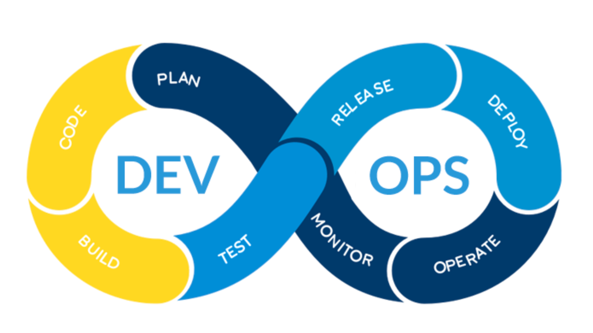
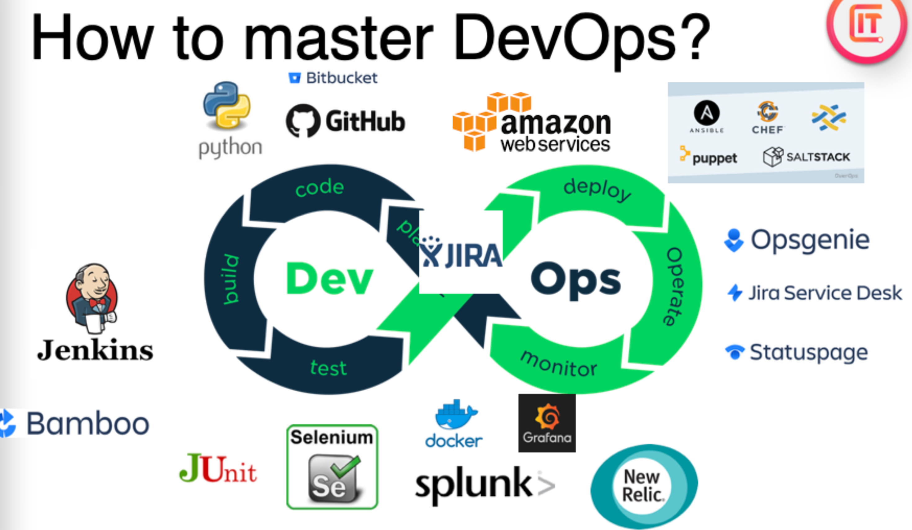
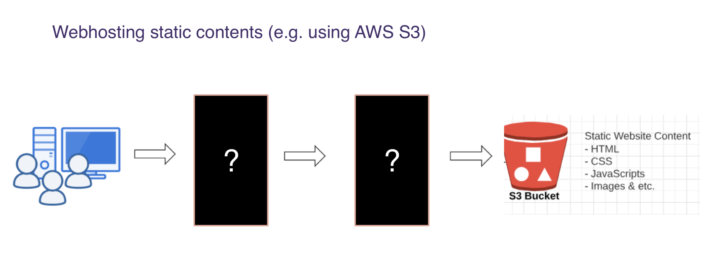
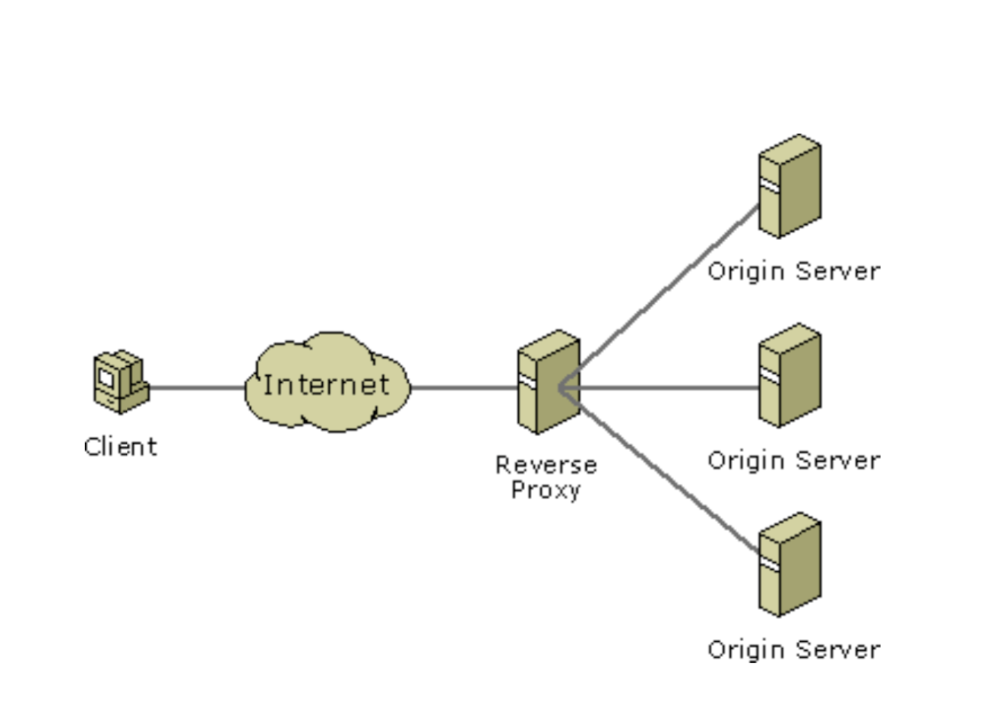
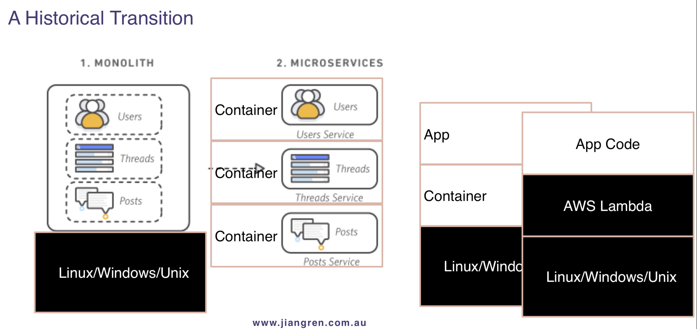
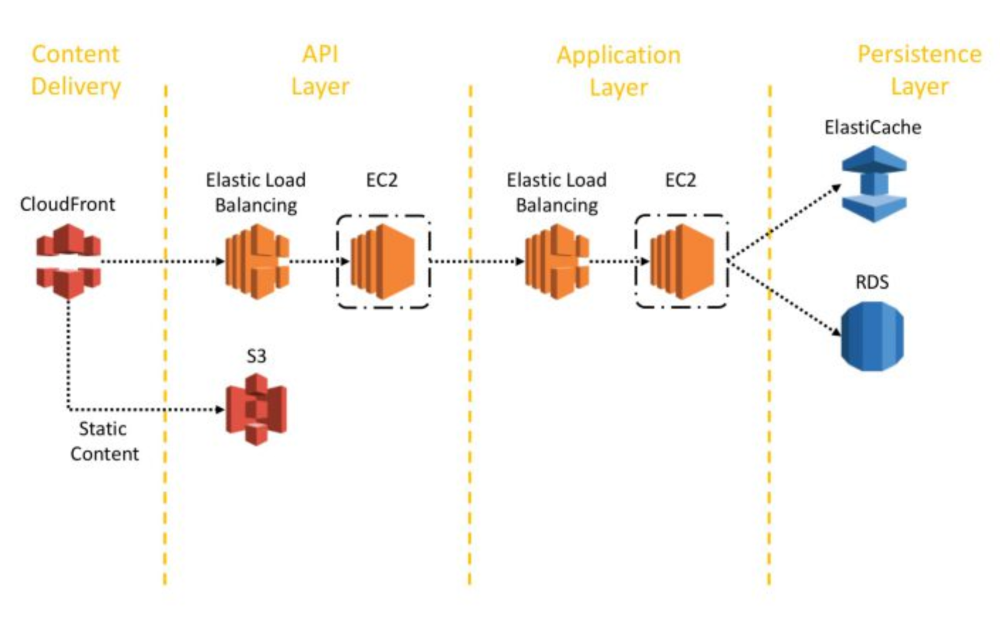
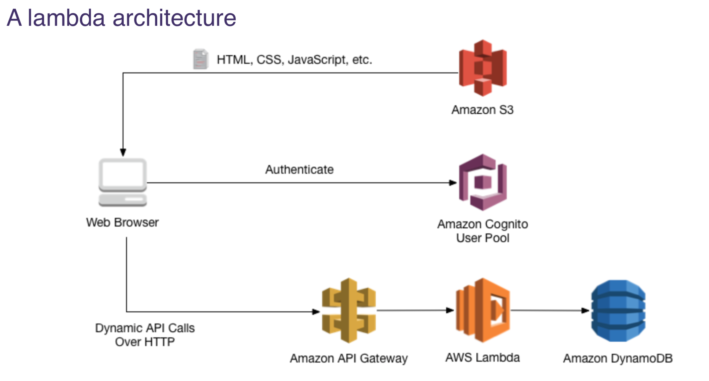
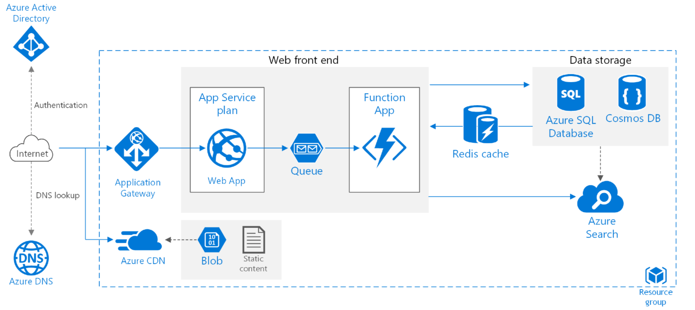
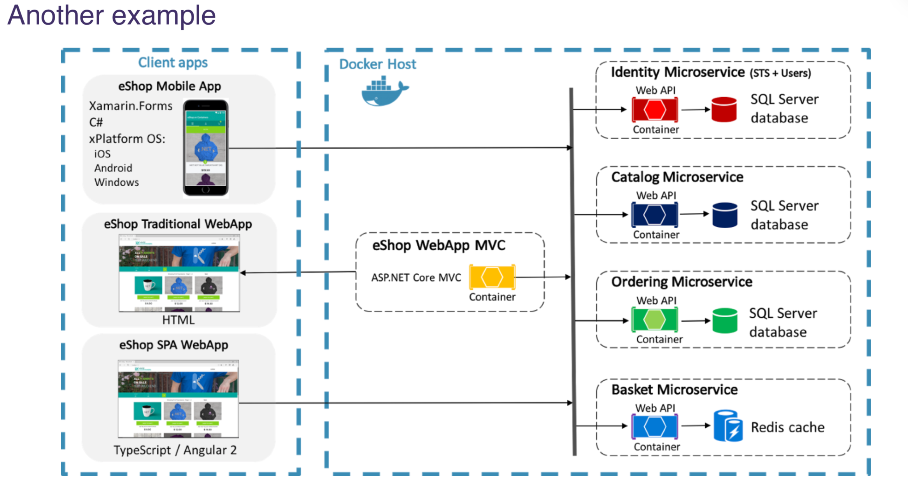
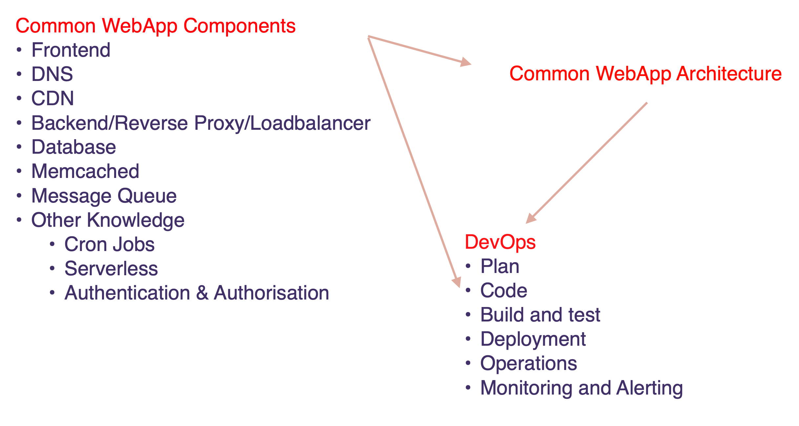

# DevOps，WebApp 和云架构总览

## 目录

1. [DevOps 介绍](#1-devops-介绍)
   - [DevOps 是什么](#devops-是什么)
   - [如何掌握 DevOps](#如何掌握-devops)
   - [DevOps 路线图](#devops-路线图)
   - [DevOps 的职业发展](#devops-的职业发展)
   - [DevOps 的职业晋升路线](#devops-的职业晋升路线)
   - [DevOps 需要处理的问题](#devops-需要处理的问题)
     - [云工程师 (Cloud Eng)](#云工程师-cloud-eng)
     - [站点可靠性工程师 (SRE)](#站点可靠性工程师-sre)
     - [DevOps 工程师 (DevOps Eng)](#devops-工程师-devops-eng)
   - [工具和自动化导向 vs 算法导向](#工具和自动化导向-vs-算法导向)
2. [WebApp 组件](#2-webapp-组件)
   - [前端组件](#前端组件)
     - [Web Hosting](#web-hosting)
     - [前端问题](#前端问题)
   - [后端组件](#后端组件)
     - [后端架构](#后端架构)
     - [后端问题](#后端问题)
     - [后端的发展进程](#后端的发展进程)
     - [常见的后端架构](#常见的后端架构)
   - [持久存储](#持久存储)
     - [四种主要数据库类型](#四种主要数据库类型)
   - [内存数据存储系统](#内存数据存储系统)
   - [其他组件](#其他组件)
     - [Cron](#cron)
     - [授权 vs 认证](#授权-vs-认证)
3. [WebApp 架构](#3-webapp-架构)
4. [DevOps 循环](#4-devops-循环)
5. [总结](#5-总结)

## 1. DevOps 介绍

### DevOps 是什么

DevOps 是一组旨在保证高质量、高可用性的同时，减少软件迭代时间的开发、测试与运维高度整合的实践。

- 历史上，开发(Dev)和运维(Ops)是分开的两个部分。
- 如同安装 Windows 需要等待很久，每次软件迭代也需要等待很久，导致用户不满；同样地，云端软件在迭代过程中也不能导致系统宕机，这需要 DevOps 过程来完成。
- 开发人员设计和开发软件（造火车），而 DevOps 负责搭建和维护系统运行的基础设施（造铁轨和监控火车运行）。
- DevOps 流程包括 CI/CD 管道测试、代码提升、staging 环境测试、部署后的系统监控等。

整个课程将围绕 DevOps Circle 展开，重点介绍最重要的工具。

### 如何掌握 DevOps

- 了解公司使用的工具
- 研究这些工具的手册，比较不同工具
- 解决工具使用中的问题（故障排除）
- 编写自动化代码

不同层次的 DevOps 角色：

- 高级 DevOps 可以做技术堆栈的决策
- 初级/中级 DevOps 需要能看懂手册并将自动化环节连接起来
- DevOps 的编程主要是自动化，减少手动操作

### DevOps 路线图

[DevOps 路线图](https://github.com/australiaitgroup/DevOps-WIKI/blob/1444e4c34e275638364c6647889e129944cea36c/DevOps%20RoadMap.docx)

总结了 DevOps 的学习方法和方向。课程按照 DevOps Circle 顺序进行，并配有大量实践操作。

### DevOps 的职业发展

DevOps 是需求量非常大的职位。随着公司从数据中心迁移到云端，DevOps 的需求越来越大。需要在短期内掌握 DevOps 的重点知识。

### DevOps 的职业晋升路线

1. 初级/毕业生阶段 (Junior/Grad)
2. 中级 DevOps/SRE (Mid DevOps/SRE)
3. 高级 DevOps/SRE (Senior DevOps/SRE)
4. 首席 DevOps/SRE (Principal DevOps/SRE)
5. 架构师 (Architect)

### DevOps 需要处理的问题

DevOps 相关工程师需要处理以下问题：

#### 云工程师 (Cloud Eng)

- 网络设置、认证/授权管理
- 基础设施管理
- PaaS 工具和自动化

#### 站点可靠性工程师 (SRE)

- 产品可靠性改进
- 监控和告警
- 配置管理
- 工具和自动化
- 事故处理

#### DevOps 工程师 (DevOps Eng)

- 关注 CI/CD、构建和测试、监控和日志

### 工具和自动化导向 vs 算法导向

重点是工具的使用和自动化，而不是算法。对算法和数据结构的要求限于完成自动化任务。

## 2. WebApp 组件

### 前端组件

前端组件包括 HTML、CSS、JS、图像等。

#### Web Hosting

静态内容托管（如使用 AWS S3），存储 HTML、CSS、JavaScript 和图像等。

用户通过以下步骤获取网站资源：

第一个问号表示 DNS（域名服务器）。

- 使用 `dig` 或 `ping` 获取网站 IP 地址
- 解析 DNS（如使用 AWS Route 53）

第二个问号表示 CDN（内容分发网络）。

- 将静态资源缓存到距离用户最近的服务器，降低延迟
- 提供低延迟、良好用户体验和全球可用性
- AWS 对应服务：CloudFront

#### 前端问题

DevOps 关注的前端问题包括：

- 如何在不影响用户的情况下部署前端代码？
- 如何安全地向客户推出新功能？
- 如何进行版本控制/回滚更改？
- 测量前端性能和可靠性的关键指标是什么？
- 使用哪些工具监控/记录前端事件？
- 可以采用哪些方法监控前端？
- 可以进行哪些类型的测试或监控？

### 后端组件

#### 后端架构

一个简单的后端架构：

用户请求通过互联网路由到后端服务器，后端的反向代理中止请求并重新包装，然后向后端服务器请求。同时，反向代理与负载均衡整合在一起。

#### 后端问题

DevOps 关注的后端问题包括：

- 如何并行处理不同用户的请求？
  - 使用反向代理/负载均衡器（如 Nginx、ELB）
  - 自动扩展无状态服务器或 Lambda 函数
  - 多区域部署
- 如何更安全地访问核心数据？
  - 使用反向代理/负载均衡器
  - HTTPS
  - 认证
  - 漏洞扫描
- 如何提高性能并降低成本？
  - 多区域部署
  - 缓存
  - 服务器端渲染
  - 更大的数据库等
- 应用/微服务之间如何通信？
  - API 通信：REST API/GraphQL API
  - 消息队列：实现异步通信

#### 后端的发展进程

- 单体架构 (Monolith)：前后端等都写在一个项目中，难以扩展
- 微服务 (Microservices)：功能分离，使用 Docker 运行
- 无服务器架构 (Serverless)：每个 Lambda 处理一个小功能，仅在请求时运行

常见的后端架构：

- 前端使用 CloudFront 获取 S3 的静态内容
- 使用 ELB 分发请求，每个 EC2 实例运行一个 Docker 容器，容器中运行服务
- API 层处理 API 请求
- 应用层提供用户服务、线程服务等
- 持久层存储数据，AWS 对应服务包括 ElasticCache、RDS

无服务器架构：

- 前端：S3
- 验证：Cognito User Pool
- API 网关、Lambda 和 DynamoDB 组成简化版架构

#### 四种主要数据库类型

1. 文本数据库（如 Excel、Google Sheets）
2. 关系数据库管理系统（如 MySQL、PostgreSQL）
3. NoSQL 和面向对象数据库（如 DynamoDB、MongoDB）
4. 时间序列数据库（如 Influx DB、TimescaleDB）

### 内存数据存储系统

即缓存：

- 数据加载速度比数据库快 8 到 10 倍
- AWS 对应服务包括 Mem

cached 和 Redis

### 其他组件

#### Cron

基于时间的任务调度器，帮助程序自动化执行。

#### 授权 vs 认证

- 认证 (Authentication)：确认用户身份
- 授权 (Authorization)：确认用户权限

## 3. WebApp 架构

- 通过 Active Directory Server 验证用户身份
- 使用 CDN 获取静态内容，前端 JS 访问应用网关
- 数据保存在数据库中，常用数据存储在 Redis 缓存中

- 后端分为不同的微服务，每个微服务的容器可横向扩展

## 4. DevOps 循环

核心问题是如何让网站正常运行：

1. 计划 (Plan)
   - 项目计划和分解，使用工具如 Jira、Trello、Portfolio
2. 编码 (Code)
   - IDE：IntelliJ、VS Code 等
   - 代码质量：结对编程、代码审查、ShellCheck、PEP8 等
   - 版本控制：Bitbucket、Git
3. 构建和测试 (Build and Test)
4. 发布和部署 (Release and Deploy)
   - 自动化构建和部署，如 Bitbucket pipeline
5. 运营 (Operate)
   - 事故管理
   - 早期检测事故，避免 IT 支持工单
6. 监控 (Monitoring)
   - 监控内容：SLIs/SLO/SLA
   - 重要信号：可用性、可靠性、延迟、吞吐量、饱和度
   - 依赖服务
   - 合成监控（黑盒监控）
   - 告警内容、方式、对象

## 5. 总结

有了左侧的组件后，可以构建架构；然后需要一个 DevOps 流程将其整合，尽可能实现自动化。
