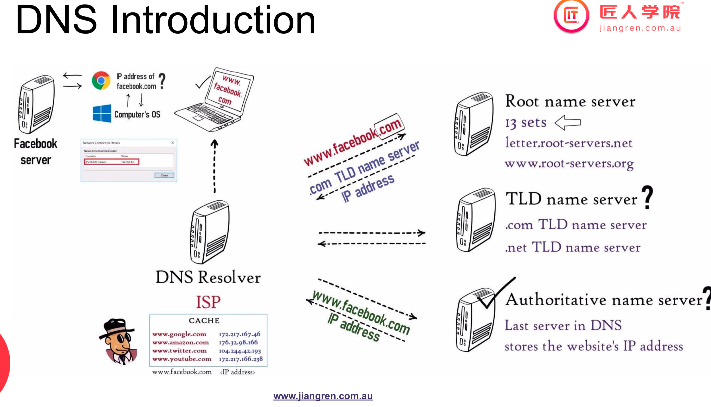
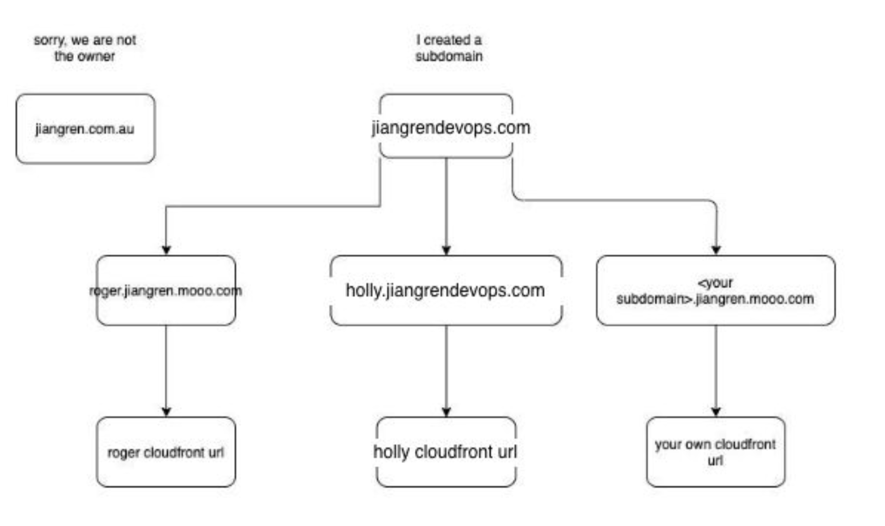
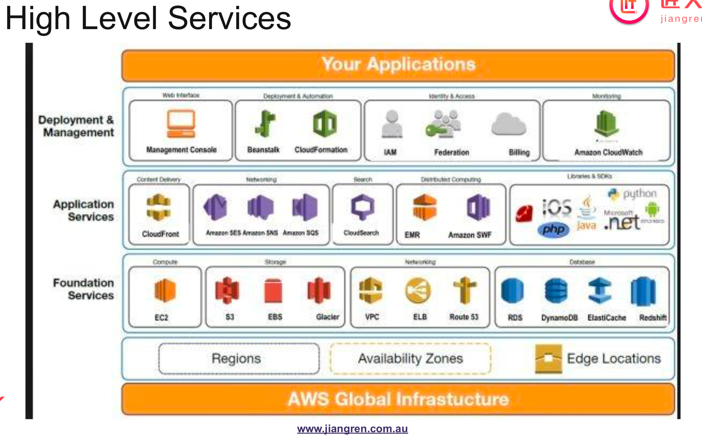

# Build and Optimise a Website with CDN & DNS

## 目录

1. [DevOps 初始设置](#1-devops-初始设置)
2. [案例分析：优化 jiangren.com.au](#2-案例分析-优化-jiangrencomau)
   - [场景描述](#场景描述)
   - [关键词提取](#关键词提取)
   - [问题分析](#问题分析)
     - [延迟](#延迟)
       - [延迟/网站访问测速](#延迟网站访问测速)
     - [测速结果分析](#测速结果分析)
     - [可用性](#可用性)
       - [DNS/网站服务器数量测试](#dns网站服务器数量测试)
     - [DNS 测试结果分析](#dns-测试结果分析)
   - [解决方案](#解决方案)
     - [内容分发网络（CDN）](#内容分发网络cdn)
       - [CDN 的作用](#cdn-的作用)
       - [AWS 上的 CDN：CloudFront 实践](#aws-上的-cdncloudfront-实践)
       - [总结 CDN](#总结-cdn)
     - [域名系统（DNS）](#域名系统dns)
       - [DNS：AWS Route53 实践](#dnsaws-route53-实践)
       - [Route53 中的 DNS 记录](#route53-中的-dns-记录)
3. [AWS](#3-aws)

## 1. DevOps 初始设置

- 创建 AWS 账户/成本控制/安装 AWS CLI
- 安装常用工具：Git、Docker、使用 Linux 命令行、Python 本地环境设置
- 参考链接: [DevOps 初始设置](https://github.com/JiangRenDevOps/DevOpsNotes/blob/master/WK0_General/devops-initial-setup.md)
- 备注：选择一门自己擅长的编程语言，如 Python 或 Java，确保达到如下水平：能不假思索地解决 LeetCode 简单题，能熟练流畅地编写一个具有读写功能的数据库 API。

## 2. 案例分析：优化 jiangren.com.au

### 场景描述

Jiangren 公司有一个面向澳大利亚客户的网站“http://jiangren.com.au”。随着公司全球市场的扩展，CEO 希望提高网站的全球用户访问体验，降低延迟，提高可用性。

### 关键词提取

从上述描述中提取关键词：

- 低延迟
- 高可用性：确保各地区用户都能正常访问，即使在某个区域受影响的情况下。

### 问题分析

#### 延迟

如果网页加载速度慢 10 ～ 20%，流量会受到严重影响。

##### 延迟/网站访问测速

使用以下工具测试网站访问速度：

[Dotcom Tools 网站速度测试](https://www.dotcom-tools.com/website-speed-test.asp)

步骤：

1. 打开以上链接，在三个不同的标签页中分别测试三次，取平均值。
2. 选择接近 AWS 数据中心的测试位置：Denver, N.Virginia, Frankfurt, Tokyo, Brisbane。
3. 选择全球性能测试（Global Performance）。

#### 测速结果分析

目前网站仅针对澳大利亚顾客服务，还未对全球顾客进行优化，需要对全球延迟进行优化。如上所示，jiangren.com.au 在 Brisbane 加载时间为 2.6 秒，但在其他位置加载时间较长。

#### 可用性

检查该网站是否有多个服务器。

##### DNS/网站服务器数量测试

使用以下工具测试网站的 DNS 和服务器数量：

- 在线工具
  - [DNS Check](https://www.whatsmydns.net)
  - 可以检测该网站在全球不同地区访问时对应的 IP 地址。
- 命令行工具
  - mac/linux: `dig`
  - windows: `nslookup`

#### DNS 测试结果分析

网站没有对全球访问做优化，仅有一个 IP/服务器来应对全球访问。这种架构称为单点故障（Single Point of Failure）。如果唯一的 EC2 节点故障，网站将不可访问。如果有恶意用户发送大量请求或使用 DDoS 攻击服务器，服务器将超载并失去服务。

### 单点故障的解决方案

#### 内容分发网络（CDN）

CDN 通过在全球不同地区设置多个边缘服务器，帮助缓存网站内容，提高访问速度。

##### CDN 的作用

- 提高页面加载速度
- 处理高流量负载
- 减少带宽消耗
- 在多个服务器之间进行负载均衡
- 保护网站免受 DDoS 攻击
- 提高应用安全性

##### AWS 上的 CDN：CloudFront 实践

- 设置步骤详见：[AWS CloudFront 设置](https://github.com/JiangRenDevOps/DevOpsLectureNotesV4/blob/main/WK1-CDN-DNS/CDN.md)
- 对应课程视频：1:12:30 ~ 1:38:10

##### 总结 CDN

CDN 提升了 jiangren.com.au 的各项指标，并没有改变任何网站设置和部署，仅仅新建了一个全球分发。CDN 适用于静态资源，后端 API 调用缓存设置未覆盖。

优点：

- 高速度：减少网页加载时间
- 高可用性：减少对原始服务器的请求，防止 DDoS 攻击

缺点：

- 额外成本：[CloudFront 价格](https://aws.amazon.com/cloudfront/pricing/)
- 应用需要通过文件版本控制进行 CDN 化，文件更新需要时间。

#### 域名系统（DNS）

DNS 逐级查询过程：

1. 在浏览器缓存中查找 IP 地址。
2. 查询 ISP（如 Telstra, Optus）。
3. 逐级查询更高层的 DNS 服务器，如 root/TLD/authoritative name server。
4. 本地名称服务器在获得结果后将结果返回给客户端，并缓存一段时间。

常用域名注册商：

- godaddy.com
- onlydomains.com
- namecheap.com
- freedns.afraid.org（免费）

在本课程中，我们将使用 AWS Route53 进行 DNS 设置。

##### DNS：AWS Route53 实践

实践步骤详见：[AWS Route53 设置](https://github.com/JiangRenDevOps/DevOpsLectureNotesV4/blob/main/WK1-CDN-DNS/DNS.md)
对应课程视频：2:04:40 ~ 2:26:00

在 Route53 中，创建 DNS 记录时注意：

- 确保域名格式正确，如 `kevin.jiangrendevops.com`。
- 创建 Alias 记录，指向 CloudFront 分发。
- 请求公有证书，确保证书状态为 issued。

##### Route53 中的 DNS 记录

每次创建一个 hosted zone 时，会自动生成两个记录：

- NS（名称服务器）
- SOA（起始授权）

经典面试题：

- 当你在浏览器中输入 www.google.com 时发生了什么？

参考链接：[What happens when you type a URL into your browser?](https://aws.amazon.com/blogs/mobile/what-happens-when-you-type-a-url-into-your-browser/)

## 3. AWS

- 市场龙头地位：市场份额 50%-65%
- AWS 业务种类丰富，常用的四大类将在课程中学习。
- 关于考证：
  - 适合入门和寻找第一份工作的人群。
  - 换职业路径的人群，通过考证书证明自己。

- 开始接触最多的是 EC2（虚拟机业务）。
- 非常鼓励大家考取 AWS 认证。

注册：[AWS Training](https://www.aws.training/SignIn?returnUrl=%2FDetails%2FeLearning%3Fid%3D20686)

Michael 老师的备考笔记：[AWS Solution Architect Associate Notes](https://github.com/michaelsu2014/aws-solution-architect-associate-notes)

### CloudFront（CDN）设置

详见：[AWS CloudFront 设置](https://github.com/JiangRenDevOps/DevOpsNotes/blob/master/WK1_CDN_DNS/CDN.md)

### AWS Route53 设置

详见：[AWS Route53 设置](https://github.com/JiangRenDevOps/DevOpsNotes/blob/master/WK1_CDN_DNS/DNS.md)
