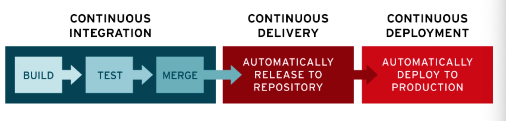
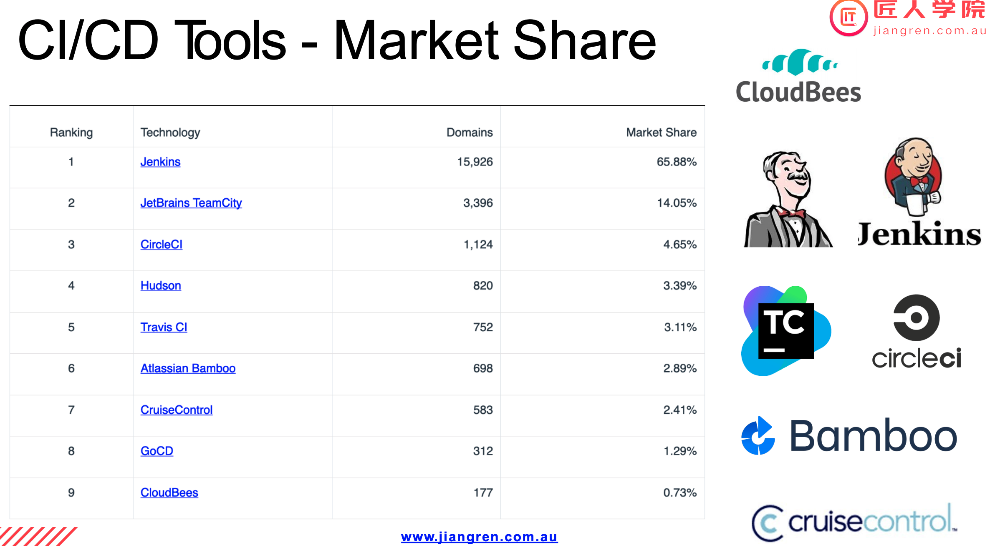

# CI/CD Overview

## Table of Contents

- [High-Level Overview](#high-level-overview)
  - [What is CI/CD](#what-is-cicd)
  - [Benefits of CI/CD](#benefits-of-cicd)
  - [CI/CD Tools](#cicd-tools)
- [DevOps (Plan/Code) and Tests](#devops-plan-code-and-tests)
  - [Before Coding](#before-coding)
  - [Start Coding](#start-coding)
  - [After Coding](#after-coding)
  - [Types of Tests in CI/CD](#types-of-tests-in-cicd)
  - [Post-Deployment Operations](#post-deployment-operations)
  - [Responsibilities](#responsibilities)
- [Hands-On](#hands-on)
  - [Step 1: Create a Repo](#step-1-create-a-repo)
  - [Step 2: Commit Your Code](#step-2-commit-your-code)
  - [Step 3: Create an Elastic Beanstalk Application](#step-3-create-an-elastic-beanstalk-application)
  - [Step 4: Create an IAM User](#step-4-create-an-iam-user)
  - [Step 5: Create Access Credentials](#step-5-create-access-credentials)
  - [Step 6: Create a CD YAML File](#step-6-create-a-cd-yaml-file)
  - [Step 7: Deployment](#step-7-deployment)

## High-Level Overview


[Reference](https://github.com/JiangRenDevOps/DevOpsLectureNotesV4/blob/main/WK4_Travis_CI_CD/dev_process_review.md)

### What is CI/CD



#### Continuous Integration

Continuous Integration (CI) involves regularly building, testing, and merging code changes to a shared repository using integration tools like TravisCI or Bitbucket pipelines. This practice addresses the problems of:

1. Conflicting code changes from multiple developers.
2. Testing and validation before merging.

#### Continuous Delivery

Continuous Delivery (CD) means that a developer’s changes to an application are automatically bug-tested and uploaded to a repository, where they can be deployed to a live production environment by the operations team. CD ensures minimal effort is required to deploy new code, addressing poor visibility and communication between development and business teams.

#### Continuous Deployment

Continuous Deployment extends continuous delivery by automatically releasing a developer’s changes from the repository to production, making them usable by customers. This practice reduces the manual workload of operations teams and speeds up application delivery.

### Benefits of CI/CD

1. Smaller code changes.
2. Fault isolations.
3. Faster mean time to resolution (MTTR).
4. More reliable tests.
5. Faster release rate.
6. Smaller backlog.
7. Increased customer satisfaction.
8. Enhanced team transparency and accountability.
9. Reduced costs.
10. Easier maintenance and updates.

[Reference](https://www.katalon.com/resources-center/blog/benefits-continuous-integration-delivery)

### CI/CD Tools



Some companies build their own tools for internal use.

## DevOps (Plan/Code) and Tests

### Before Coding

#### Planning

Using Jira software to plan the project and create tasks and sub-tasks. For example, in a team of 4-5 members, tasks might include:

- Dockerize Python code.
  - Definition of Done: Expose a code, install necessary libraries, use uWSGI instead of Python.
- Add a user API.
- Add an organization API.

Team members estimate story points for each task and assign tasks to themselves. Efficiency is important, so team members should seek help if stuck.

#### Using GitHub

Using GitHub for coding and CI/CD pipeline management. Common Git commands include:

- `git clone <repo>`
- `git checkout -b issue/<issue-number>`
- `git status`
- `git add`
- `git push`

Devs usually work on branches instead of the main/master branch.

### Start Coding

#### Preparation

- Set up the IDE.
- Install dependencies and set up the project.
- Write tests.
- Write code.
- Add monitoring.

### After Coding

#### Validation and Commit

- Validate the code.
- Commit the code.
- Trigger CI tests.
- Peer review the pull request (PR).
- Merge the PR.

#### Checking Commits

- Use `git status` to check the status.
- Use `git diff` to view changes.

### Types of Tests in CI/CD

Create tests to validate code changes and ensure they are automatically run in the CI pipeline.

#### Types of Tests

1. **Unit Test**: Tests individual components or functions.

   - Example: [Unit Test Demo](https://github.com/JiangRenDevOps/DevOpsNotes/tree/master/WK4_Overview_CI_CD/hands_on/unit_test_demo)

   ```python
   class Calculator:
       def __init__(self, a: int, b: int):
           self.a = a
           self.b = b

       def add(self):
           return self.a + self.b

       def minus(self):
           return self.a - self.b

       def multiply(self):
           return self.a * self.b

       def divide(self):
           return self.a / self.b
   ```

   ```python
   import unittest
   from .calculator import Calculator

   class TestCalculator(unittest.TestCase):
       def setUp(self):
           self.calculator = Calculator(3, 2)

       def test_add(self):
           self.assertEqual(5, self.calculator.add())

       def test_minus(self):
           self.assertEqual(1, self.calculator.minus())

       def test_multiply(self):
           self.assertEqual(6, self.calculator.multiply())

       def test_divide(self):
           self.assertEqual(1.5, self.calculator.divide())

   if __name__ == '__main__':
       unittest.main()
   ```

2. **Integration Test**: Tests combined units or components.

   - Example: Use curl or Postman to test API endpoints.

3. **Performance/System Test**: Tests the system under load.

   - Example: [Load Test Demo](https://github.com/JiangRenDevOps/DevOpsNotes/tree/master/WK4_Overview_CI_CD/hands_on/load_test_demo)

   ```python
   from locust import HttpUser, task, between

   class QuickstartUser(HttpUser):
       wait_time = between(5, 9)

       @task
       def index_page(self):
           self.client.get("/")

       @task(3)
       def view_organisation(self):
           self.client.get("/organisation/1")

       def on_start(self):
           self.client.post("/login/", {"username": "test@gmail.com", "password": "shh"})
   ```

4. **Acceptance/End-to-End Testing**: Tests the application from end to end.
   - Example: [WebDriver Demo](https://github.com/JiangRenDevOps/DevOpsNotes/tree/master/WK4_Overview_CI_CD/hands_on/webdriver_demo)

[Reference](https://www.atlassian.com/continuous-delivery/software-testing/types-of-software-testing)

### Post-Deployment Operations

Once the code reaches the production environment, the real challenge begins. Production environments have complex setups and dependencies. Operation can take up to 80% of the total cost, work, and time.

#### Key Considerations

- **Deployment**: Ensure zero downtime.
- **Deployment Strategy**: Reduce the blast radius of incidents.
- **Monitoring & Alerting**: Identify bottlenecks and set up effective monitoring and alerting systems.
- **Capacity Management**: Set the correct scaling policy.
- **Operations**: Recycle nodes without affecting customers, rollback quickly if problems arise, and reduce Mean Time To Recover (MTTR) during incidents.

### Responsibilities

#### Dev Responsibilities

- Write code and unit tests.
- Add metrics and logs.
- Dockerize the repository with DevOps.

#### DevOps Responsibilities

- Collaborate on Dockerization.
- Set up the CI/CD pipeline.
- Create testing plans.
- Set up monitoring systems.
- Automate rollback and blockers.

#### SRE Responsibilities

- Solve post-deployment operational issues.
- Improve monitoring and alerts.
- Tune system parameters.
- Develop automation tools.
- Facilitate incident mitigation and investigation.

## Hands-On

### Step 1: Create a Repo

1. Create a repository on GitHub called `docker-intro`.
2. Add a README file and ensure the MAIN branch is available.
3. Clone the repository locally.

### Step 2: Commit Your Code

1. Create a new branch: `git checkout -b "issue/MP-1-init-the-folder"`.
2. Copy files from `WK3_Dockerisation/docker-intro`.
3. Add the files: `git add .`.
4. Commit the changes: `git commit -m "MP-1 Initialise the folder"`.
5. Push the branch: `git push --set-upstream origin issue/MP-1-init-the-folder`.
6. Create and merge a Pull Request.
7. Checkout and pull the main branch.

### Step 3: Create an Elastic Beanstalk Application

1. Create an Elastic Beanstalk application in the `ap-southeast-2` (Sydney) region called `sample-docker-react`.
2. Elastic Beanstalk will create an environment named `Sample-docker-react-env`.
3. Choose Docker as the engine and submit.

### Step 4: Create an IAM User

1.

In IAM -> Users, create a user and attach the following policies:

- AdministratorElasticBeanstalk
- EC2FullAccess
- VPCFullAccess

### Step 5: Create Access Credentials

1. Create access credentials for the user.
2. Save the credentials and add them to GitHub repository secrets (`AWS_ACCESS_KEY_ID` and `AWS_SECRET_ACCESS_KEY`).

### Step 6: Create a CD YAML File

1. Create a new branch.
2. Create the `.github/workflows/` folder and a `cd-elasticbeanstalk.yml` file.
3. Update the S3 bucket name in the script below.
4. Commit, push, review, and merge the PR.

```yaml
name: Deploy to Elastic Beanstalk

on:
  pull_request:
    types: [closed]
  workflow_dispatch:

jobs:
  deploy:
    runs-on: ubuntu-latest
    steps:
      - name: Checkout code
        uses: actions/checkout@v2

      - name: Create ZIP deployment package
        run: zip -r deploy_package.zip ./

      - name: Install AWS CLI
        run: |
          sudo apt-get update
          sudo apt-get install -y python3-pip
          pip3 install --user awscli

      - name: Configure AWS credentials
        uses: aws-actions/configure-aws-credentials@v1
        with:
          aws-access-key-id: ${{ secrets.AWS_ACCESS_KEY_ID }}
          aws-secret-access-key: ${{ secrets.AWS_SECRET_ACCESS_KEY }}
          aws-region: ap-southeast-2

      - name: Upload package to S3 bucket
        run: aws s3 cp deploy_package.zip s3://elasticbeanstalk-ap-southeast-2-<account-id>

      - name: Deploy to Elastic Beanstalk
        run: |
          aws elasticbeanstalk create-application-version \
            --application-name sample-docker-react \
            --version-label ${{ github.sha }} \
            --source-bundle S3Bucket="elasticbeanstalk-ap-southeast-2-<account-id>",S3Key="deploy_package.zip"

          aws elasticbeanstalk update-environment \
            --environment-name Sample-docker-react-env \
            --version-label ${{ github.sha }}
```

### Step 7: Deployment

The deployment will now be triggered every time a PR is merged. Ensure AWS credentials are securely stored in GitHub settings for seamless deployment.
