# Jenkins CI/CD I

## 目录

- [课堂笔记](#课堂笔记)
  - [GOAL of this class](#goal-of-this-class)
  - [CI / CD](#ci--cd)
    - [Continuous Integration(CI)](#continuous-integrationci)
    - [Continuous Delivery (CD)](#continuous-delivery-cd)
  - [Benefits of CI/CD](#benefits-of-cicd)
  - [CI/CD Tools](#cicd-tools)
  - [Jenkins History](#jenkins-history)
  - [Jenkins Core Concept](#jenkins-core-concept)
  - [Jenkins Pipeline](#jenkins-pipeline)
  - [Jenkins Configuration Management](#jenkins-configuration-management)
  - [Install a Jenkins Server](#install-a-jenkins-server)

## CI / CD

First of all, let's review the advantages of continuous integration:

1. Reduce the labor force
2. Avoid human error
3. Improve efficiency
4. Continuous feedback on quality
5. Quality assurance

Second, to use Jenkins for continuous integration, you should have knowledge including:

- Linux
- Git
- Jenkins
- Maven
- JDK
- Other programming tools

### Continuous Integration(CI)

Continuous Integration is a practice where development teams frequently commit application code changes to a shared repository. These changes automatically trigger new builds which are then validated by automated testing to ensure that they do not break any functionality.
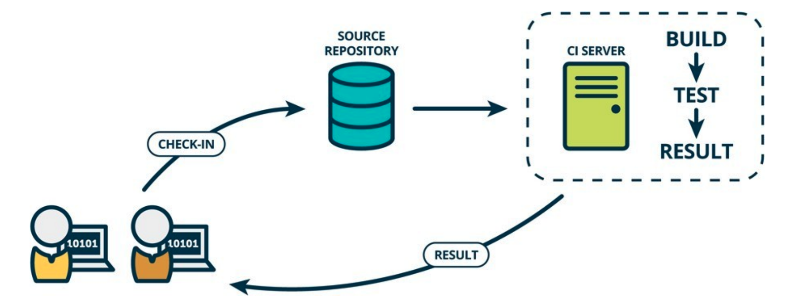

- **Software build tools**

  https://www.plutora.com/ci-cd-tools/software-build-tools

- **Traditional way of testing**
  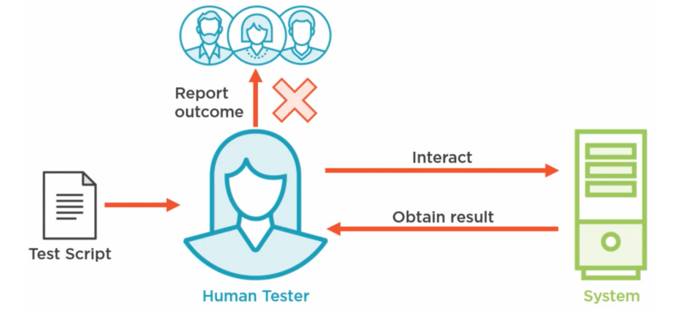

- **Automated testing**
  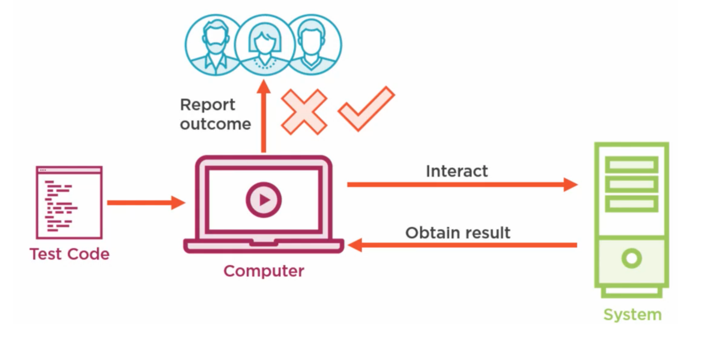

- **Benefits of automated testing**
  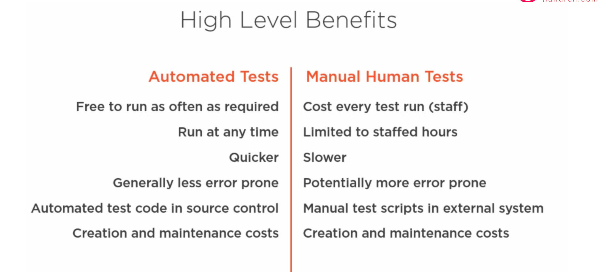

- **Relative cost of fixing defects in different stages of software development**
  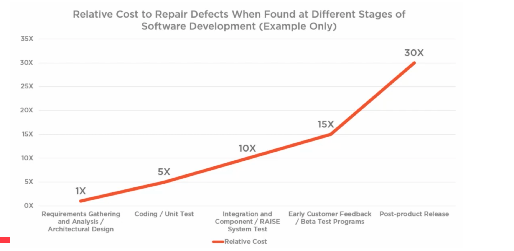

- **Testing Pyramid**
  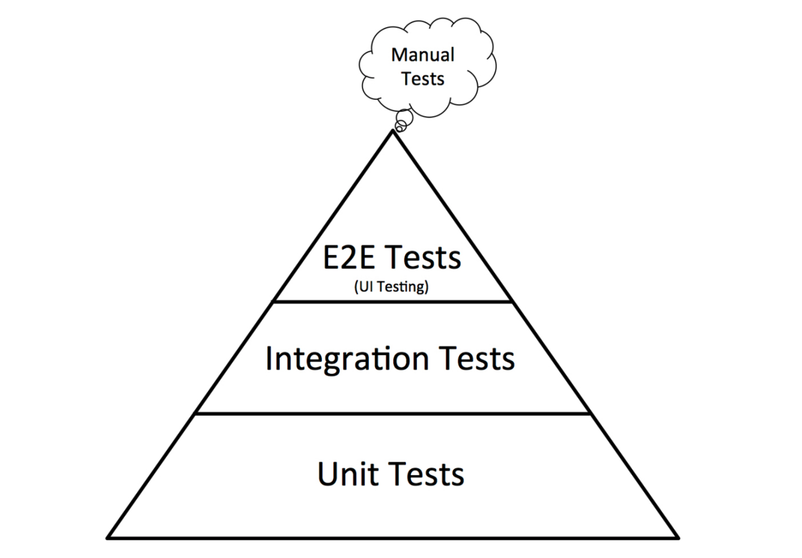

- **Testing process**
  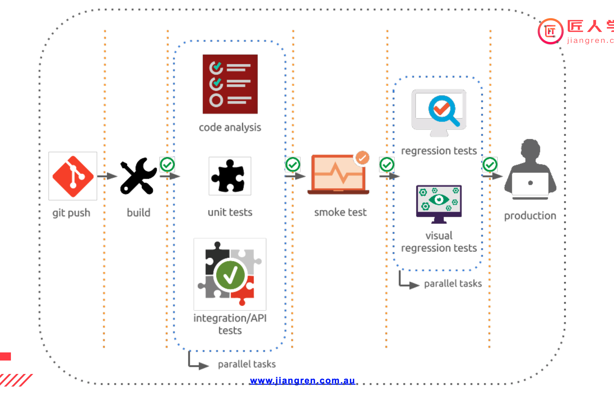

### Continuous Delivery (CD)

CD is also used to describe Continuous Deployment which focuses on the automation process to release what is now a fully functional build into production.
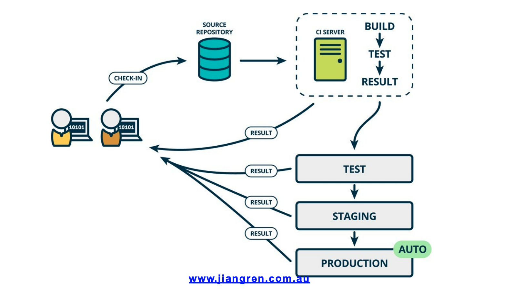

- **Deployment**
  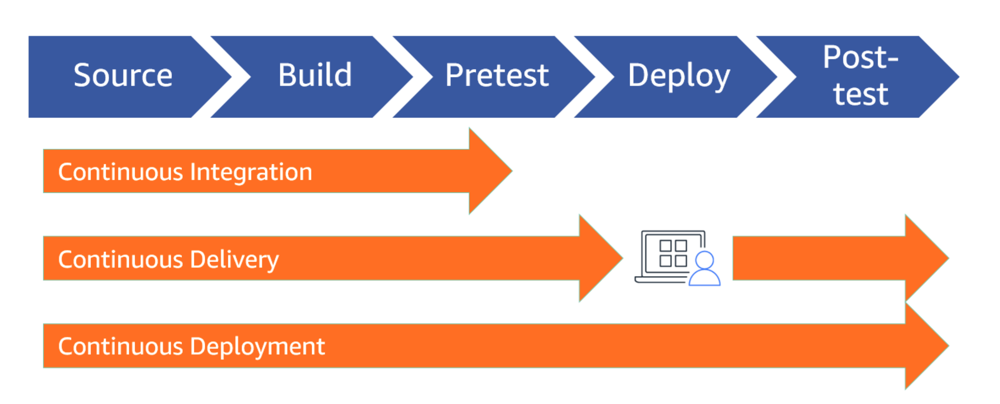
- **Deployment environments**
  

## Benefits of CI/CD

1. Smaller Code Changes
2. Fault Isolations
3. Faster Mean Time To Resolution (MTTR)
4. More Test Reliability
5. Faster Release Rate
6. Smaller Backlog
7. Customer Satisfaction
8. Increased Team Transparency and Accountability
9. Reduced Costs
10. Easier Maintenance and Updates

    Ref: https://www.katalon.com/resources-center/blog/benefits-continuous-integration-delivery

## CI/CD Tools

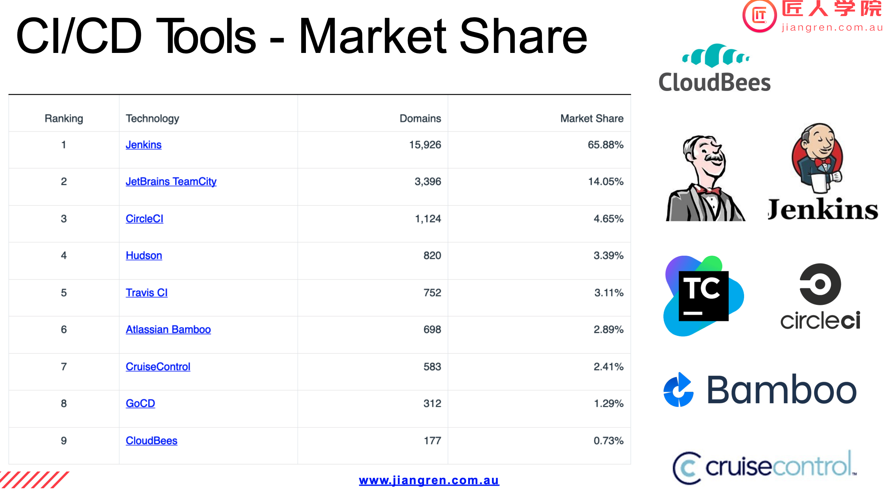

Some big companies build their own tools for internal use.

## Jenkins History

The leading open-source automation server, Jenkins provides hundreds of plugins to support building, deploying, and automating any project.

- 2004 - Kohsuke Kawaguchi created Hudson in Sun Microsystems
- 2005 - Hudson is released
- 2011 - Hudson renamed to Jenkins after Oracle purchased Sun Microsystems
- 2010 - CloudBees is created
- 2014 - CloudBees shifts focus to Enterprise Jenkins and provides commercial support for Jenkins.
- 2014 - Kawaguchi becomes CTO of CloudBees

## Jenkins Core Concept

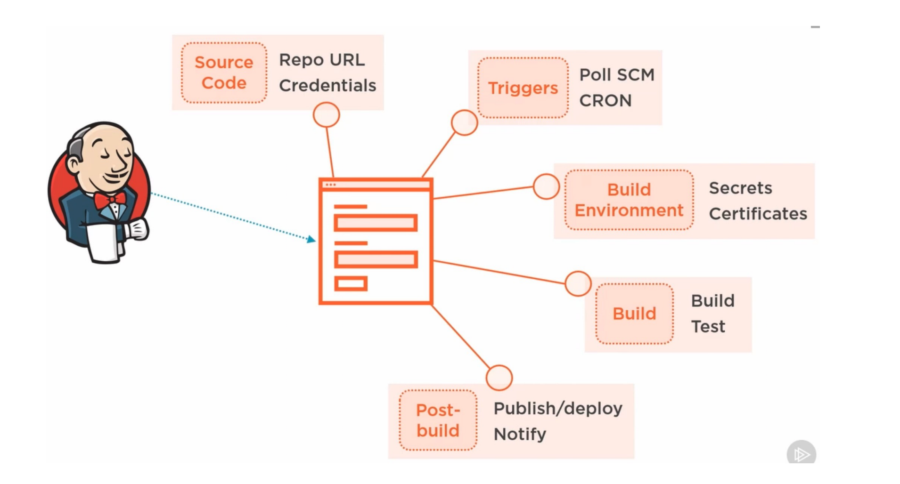

- Jenkins Job
- Jenkins Build
- Jenkins Plugin
- Jenkins View (Dashboard View)
- Jenkins Node: Master/Agent
- Jenkins Credential
- Jenkins Configuration
- Jenkins Logs
- Jenkins SSO and Global Security
- Jenkins Pipeline

## Jenkins Pipeline

### What is Jenkins Pipeline?

Jenkins Pipeline is a combination of plugins that support the integration and implementation of continuous delivery pipelines. It has an extensible automation server to create simple and complex delivery pipelines as code via pipeline DSL. A Pipeline is a group of events interlinked with each other in a sequence.

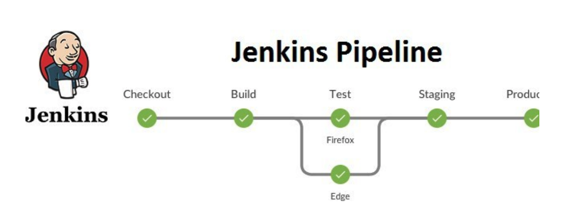

- **Jenkins config.xml**

  Jenkins has two types of `config.xml` files. One is under Jenkins home which configures the Jenkins server, and the other is in each job or project's directory containing the job’s configuration.
  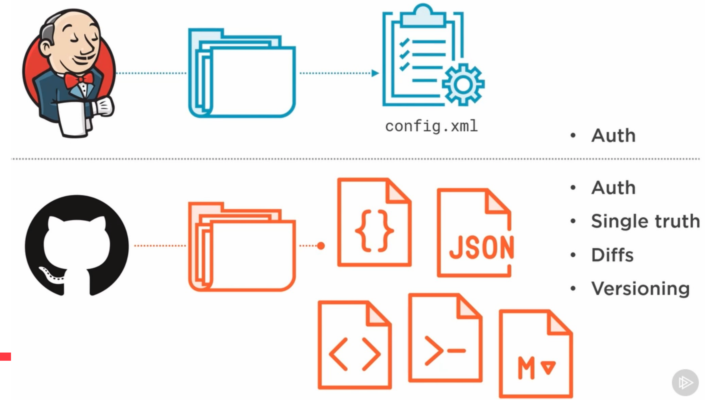

- **Jenkinsfile**

  Jenkins pipelines can be defined using a text file called `Jenkinsfile`. You can implement pipeline as code using Jenkinsfile, defined by a domain-specific language (DSL). With Jenkinsfile, you can write the steps needed for running a Jenkins pipeline.
  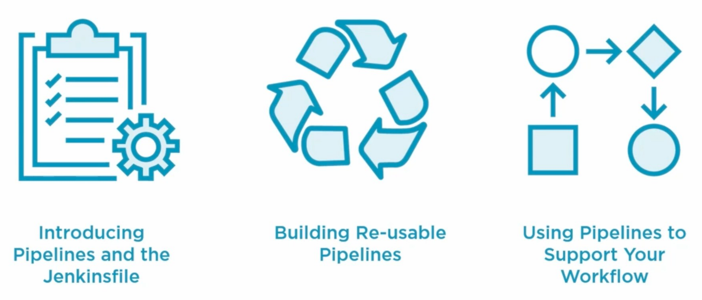

- **Jenkins Pipeline - in the real world**

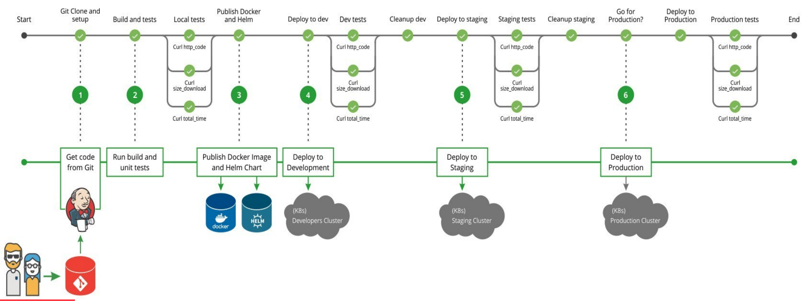

## Jenkins Configuration Management

Jenkins configuration management includes configuring GitHub Pipeline and Plugins manually in Jenkins, which should be automated. There are a few ways to automate this:

1. Dockerize Jenkins and add the configuration into Dockerfile - https://github.com/jenkinsci/docker/blob/master/README.md
2. Use configuration management tools to configure Jenkins
3. Backup Jenkins configuration files and logs regularly

## Install a Jenkins Server

### Common options to install Jenkins

1. Official - https://jenkins.io - java -jar jenkins.war
2. Docker - https://hub.docker.com/r/jenkins/jenkins/
3. Kubernetes: for large scale parallel tasks

   - Kubernetes application
   - Helm

     ```bash
     helm install --name jenkins stable/jenkins --set rbac.install=true --set Persistence.Enabled=true --set Persistence.StorageClass=jenkins-pv
     ```

4. Configuration Management Tool: Chef, Puppet, Ansible, or Saltstack
5. Use Jenkins in the Cloud: CloudBees, Bitnami

### Hands-on: Install Jenkins in Docker locally

Repo: https://github.com/sean4wsome/jrcms

- Handson 1: [Jenkins installation](https://github.com/JiangRenDevOps/DevOpsLectureNotesV4/tree/main/WK3_CI-CD-Jekins/1.Install-Jenkins-Docker)
- Handson 2: [Integrate Jenkins with a GitHub Organization](https://github.com/JiangRenDevOps/DevOpsLectureNotesV4/tree/main/WK3_CI-CD-Jekins/3.Integrate-with-Github)
- Handson 3: [Expose Jenkins to the Internet](https://github.com/JiangRenDevOps/DevOpsLectureNotesV4/tree/main/WK3_CI-CD-Jekins/2.Expose-Jenkins-to-Public-Internet)
- Handson 4: [Build Jenkins pipeline using Blue Ocean interface](https://github.com/JiangRenDevOps/DevOpsLectureNotesV4/tree/main/WK3_CI-CD-Jekins/5.Jenkins-BlueOcean-Pipeline)
- Handson for next lesson: [Install Jenkins on Kubernetes](https://github.com/JiangRenDevOps/DevOpsLectureNotesV4/tree/main/WK3_CI-CD-Jekins/4.Install-Jenkins-Kubernetes)

### More references for Jenkins pipeline

Jenkins pipeline uses the Groovy language, similar to Teamcity and Bamboo.

- https://jenkins.io/doc/book/pipeline/
- https://jenkins.io/doc/book/pipeline/pipeline-best-practices/
- https://github.com/davisliu11/jenkins-pipeline-examples

## How to work out my Jenkinsfile?

Reading documents is an essential skill for a DevOps Engineer. Please read this doc to learn more about `Jenkinsfile`: <https://www.jenkins.io/doc/book/pipeline/jenkinsfile/>

To learn more details about the Jenkins pipeline, please read: <https://www.jenkins.io/doc/book/pipeline/getting-started/>

#### Step 7: In Jenkins, you should see a new build is triggered.
