# Jenkins CI/CD II

## 目录

- [DevOps Overview](#devops-overview)
- [What is CI/CD](#what-is-cicd)
  - [Continuous Integration](#continuous-integration)
  - [Continuous Delivery](#continuous-delivery)
  - [Continuous Deployment](#continuous-deployment)
- [Travis CI/CD Hands-On](#travis-cicd-hands-on)
  - [Goal](#goal)
  - [Prerequisite](#prerequisite)
  - [Hands-On Steps](#hands-on-steps)
    - [Create and Run a Web App](#create-and-run-a-web-app)
    - [Dockerize Your Web App](#dockerize-your-web-app)
    - [Add the Repo to GitHub](#add-the-repo-to-github)
    - [Integrate with TravisCI](#integrate-with-travisci)
    - [Create AWS Elastic Beanstalk](#create-aws-elastic-beanstalk)
    - [Set Up IAM User](#set-up-iam-user)
    - [Add a S3 Folder for Elastic Beanstalk App](#add-a-s3-folder-for-elasticbeanstalk-app)
    - [Add the Deploy Code to Travis YML](#add-the-deploy-code-to-travis-yml)
    - [Setup Secrets in Travis](#setup-secrets-in-travis)
    - [Commit Code, Create Pull Request, Push to Repo and Trigger CD Pipeline](#commit-code-create-pull-request-push-to-repo-and-trigger-cd-pipeline)
    - [Trigger the Build](#trigger-the-build)
- [Discussion](#discussion)
- [Extension](#extension)
- [Setting up CI/CD for our CMS project](#setting-up-cicd-for-our-cms-project)
  - [Recap](#recap)
  - [CI/CD - Practical Example](#cicd---practical-example)
    - [Jenkins + Docker](#jenkins--docker)
    - [Jenkins Based on Kubernetes Cluster](#jenkins-based-on-kubernetes-cluster)
    - [Kubernetes Components](#kubernetes-components)
      - [Control Plane Components](#control-plane-components)
      - [Node Components](#node-components)
    - [Elastic Beanstalk in AWS](#elastic-beanstalk-in-aws)
  - [Hands-on: Setting Up CI/CD for Our CMS Project](#hands-on-setting-up-cicd-for-our-cms-project)
    - [Pre-requisites](#pre-requisites)
    - [Hands-on Steps](#hands-on-steps)

## DevOps Overview

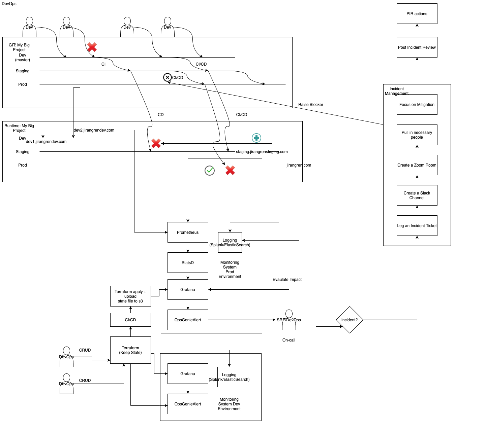
[Reference](https://github.com/JiangRenDevOps/DevOpsLectureNotesV4/blob/main/WK4_Travis_CI_CD/dev_process_review.md)

## What is CI/CD

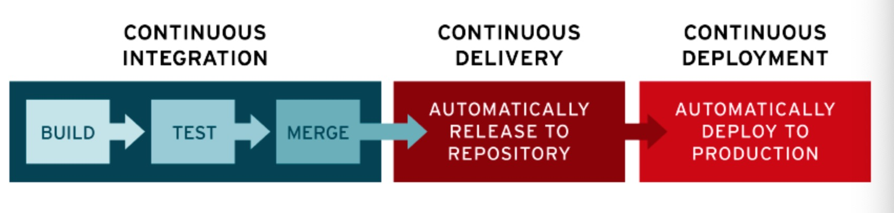

### Continuous Integration

Continuous Integration (CI) means code changes to a web application are regularly built, tested, and merged to a shared repository automatically via integration tools like TravisCI or Bitbucket pipelines. It addresses the issues of:

1. Conflicting code changes from multiple developers.
2. Testing and validation before merging.

### Continuous Delivery

Continuous Delivery (CD) ensures that a developer’s changes to an application are automatically bug tested and uploaded to a repository (like GitHub or a container registry), where they can then be deployed to a live production environment by the operations team. CD minimizes the effort required to deploy new code, enhancing visibility and communication between development and business teams.

### Continuous Deployment

Continuous Deployment extends continuous delivery by automatically releasing a developer’s changes from the repository to production, making them usable by customers. This practice reduces the manual workload of operations teams and speeds up application delivery.

## Travis CI/CD Hands-On

### Goal

Build, test, and deploy a web application to AWS Elastic Beanstalk from scratch. This step-by-step guide will help you set up a simple CI/CD pipeline via Travis CI and deploy a React app on AWS.

[Reference](https://medium.com/paul-zhao-projects/building-a-ci-cd-pipeline-with-travis-ci-docker-and-aws-in-9-steps-4f51f5be921a)

### Prerequisite

- Installed Docker
- Docker account (register at docker.com)
- Installed NPM [Download and Install Node.js and npm](https://docs.npmjs.com/downloading-and-installing-node-js-and-npm)
- AWS account

### Hands-On Steps

#### Create and Run a Web App

Create a sample web application skeleton with npx:

```bash
$ npx create-react-app my-app
npx: installed 98 in 6.337s

Creating a new React app in /Users/paulzhao/my-app.

Installing packages. This might take a couple of minutes.
Installing react, react-dom, and react-scripts with cra-template...

.
.
.
```

Run the web application:

```bash
$ cd my-app
$ npm start
```

You should see this on localhost:3000:
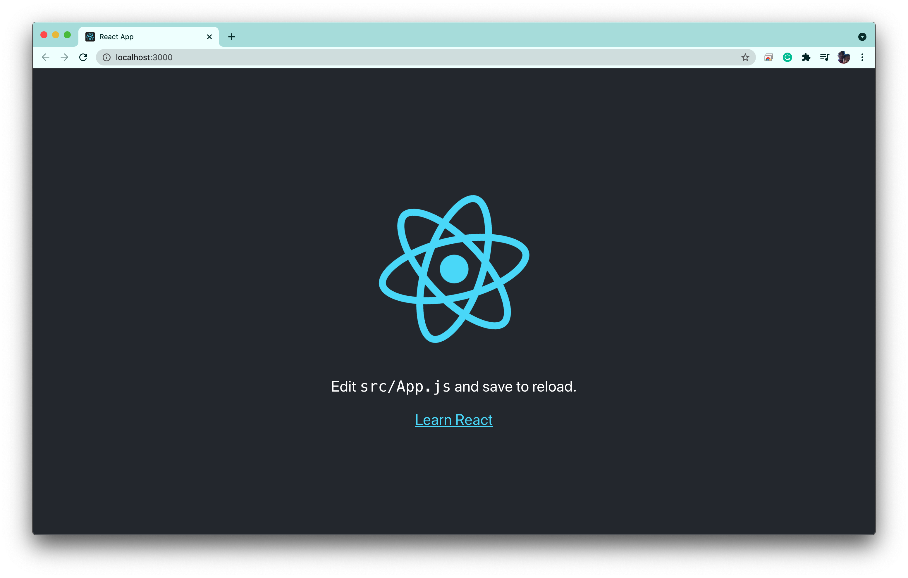

#### Dockerize Your Web App

Add two files to the `my-app` folder:

**Dockerfile** — Used for building the image that contains the optimized version of this application:

```dockerfile
FROM node:latest AS builder
WORKDIR './app'
COPY package*.json ./
RUN npm install
COPY ./ ./
RUN npm run build

FROM nginx
EXPOSE 80
COPY --from=builder /app/build /usr/share/nginx/html
```

**Dockerfile.dev** — Used for building the image that contains the development version which would be used to run tests:

```dockerfile
FROM node:latest
WORKDIR '/app'
COPY package.json .
RUN npm install
COPY . .
CMD ["npm", "start"]
```

Your folder structure should now look like this (without the `.travis.yml` file):
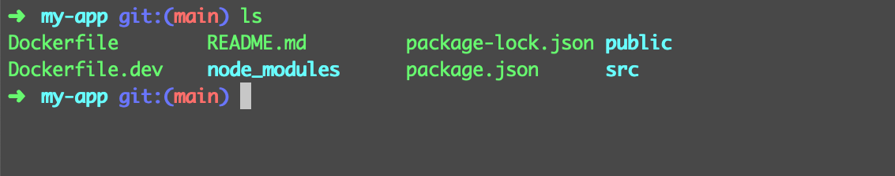

#### Add the Repo to GitHub

Create a repository on GitHub:
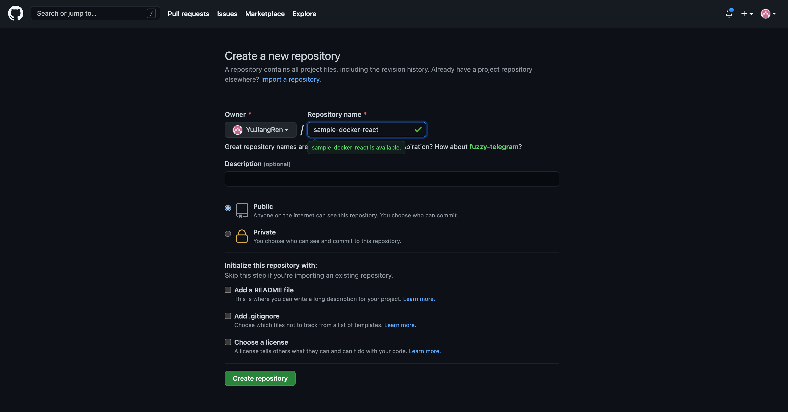

Follow the steps in the second section to push the existing repo from the command line:
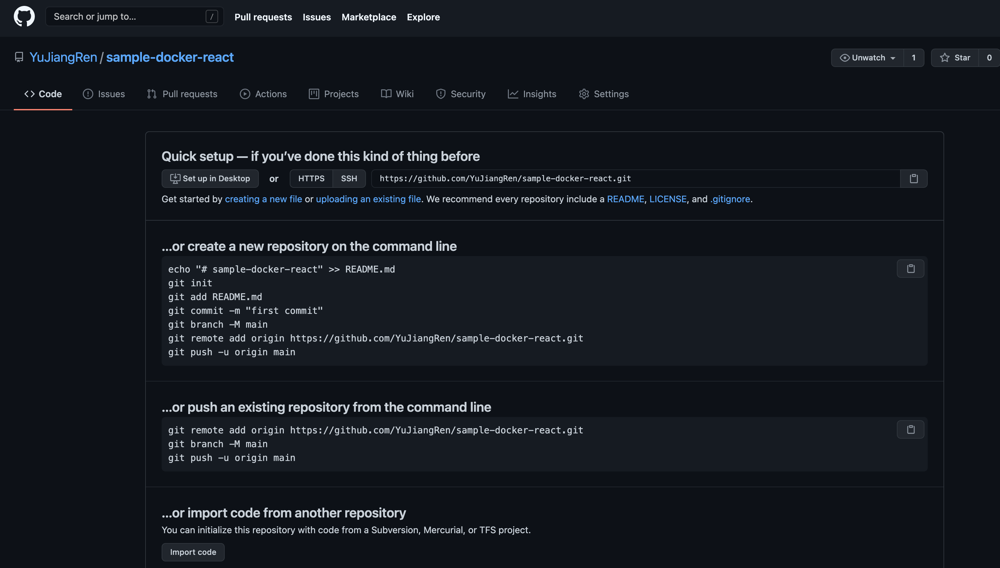

#### Integrate with TravisCI

Go to [Travis CI](https://travis-ci.com) and log in with your GitHub account:
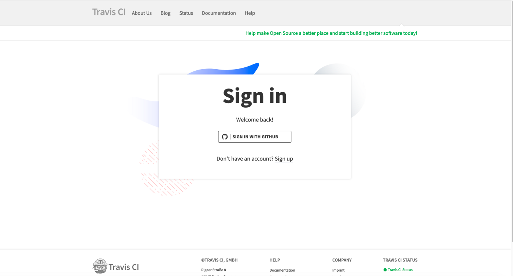

Add the repository to Travis (The repository should show up when you click add repo).

Create a `.travis.yml` file in the repo and add the following code:

```yaml
sudo: required
language: node_js
node_js:
  - "stable"

services:
  - docker

before_install:
  - docker build -t yuwangjr/sample-app -f Dockerfile.dev .

script:
  - docker run -e CI=true yuwangjr/sample-app npm run test -- --coverage --watchAll=false
```

Please replace `yuwangjr` with your Docker account.

**Explanations:**

- `sudo: required`: Travis CI requires elevated permissions.
- `language: node_js`: Specifies the language for building the app.
- `services`: Tells Travis CI that we need a Docker instance running for this build.
- `before_install`: Builds the Docker image using our Dockerfile.dev file and tags it.
- `script`: Runs the tests by running the Docker image and overriding the command specified in the Dockerfile.dev.

(Optional) You can run the Docker commands above yourself:


(Optional) You can also run Docker locally:

```bash
# Build an image with the tag sample app
docker build -t sample-app .

# Run the app at port 80
docker run -p 80:80 sample-app

# Access the React UI via localhost
```

#### Create AWS Elastic Beanstalk

AWS Elastic Beanstalk is an easy-to-use service for deploying and scaling web applications. Configure AWS manually via AWS UI to understand the bare minimum requirements.

Sign in to AWS, hover on services, select Elastic Beanstalk, then select `Create New Application`.

Name it `sample-docker-react`:


Fill in the platform info:


Click configure more options and click Network -> Edit, configure VPC:


Choose a VPC, click Public IP address, and us-east-1a -> Save:


Create the app:


You might also see:


#### Set Up IAM User

Create an IAM user with proper permissions so Travis can deploy the app on your behalf:


Add a user and click programmatic access:


Attach the following policy to this user:
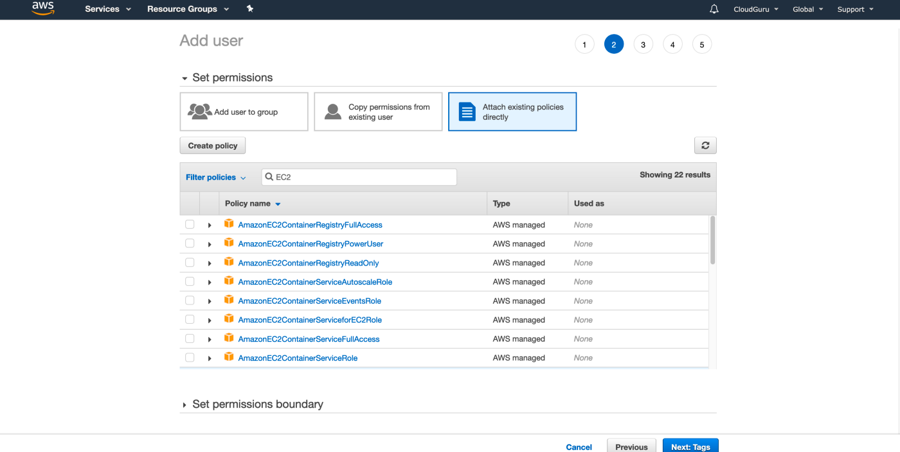
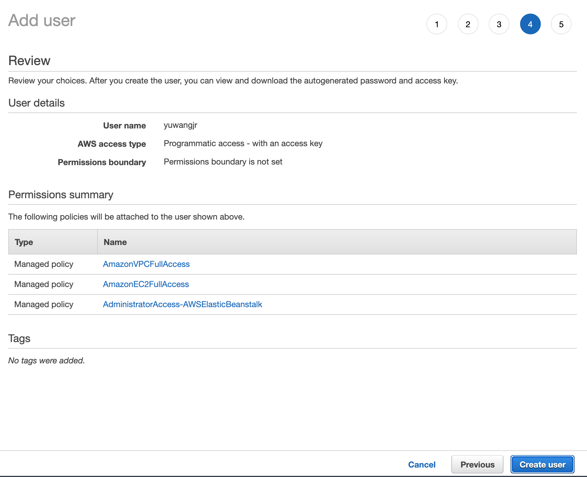

Once created, download the CSV immediately, otherwise, you won't be able to see the secrets anymore:
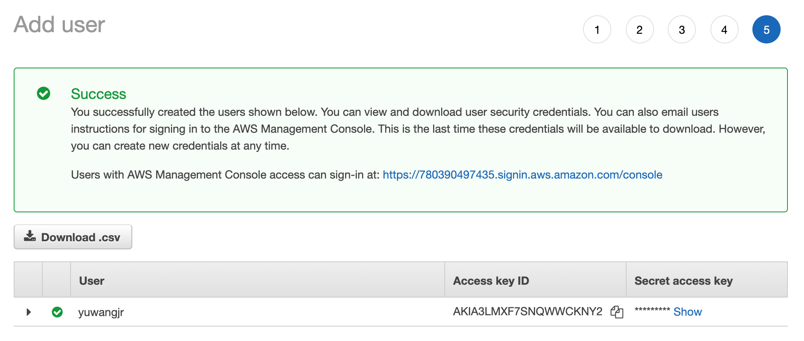

#### Add a S3 Folder for Elastic Beanstalk App

Amazon S3 provides object storage through a web service interface. After creating an Elastic Beanstalk environment, an S3 bucket is created to store applications deployed in environments.

Create a folder called "EBApptest":
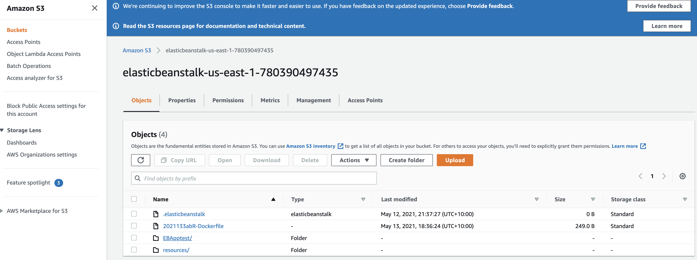

#### Add the Deploy Code to Travis YML

Add the following code to `.travis.yml` and replace the bucket name and bucket path with yours:

```yaml
deploy:
  provider: elasticbeanstalk
  region: "us-east-1"
  app: "sample-docker-react"
  env: "Sampledockerreact-env"
  bucket_name: "elasticbeanstalk-us-east-1-780390497435"
  bucket_path: "E

BApptest"
  on:
    branch: main
  access_key_id: "$AWS_ACCESS_KEY"
  secret_access_key: "$AWS_SECRET_KEY"
```

- `deploy`: Tells Travis CI how to deploy your app.
- `provider`: Platform to be used.
- `region`: AWS region of your choice.
- `app`: Your Elastic Beanstalk app name.
- `bucket_name`: The S3 bucket name generated for the server location used for your environment.
- `bucket_path`: The folder created on AWS to receive the app from Travis CI.
- `on`: Tells Travis CI which GitHub branch update should trigger a build.
- `access_key_id`: IAM access key generated in AWS but stored in Travis CI.
- `secret_access_key`: IAM secret key generated in IAM of AWS but stored in Travis CI.

[Reference](https://github.com/YuJiangRen/sample-docker-react/blob/main/.travis.yml)

[Travis CI Deployment Docs](https://docs.travis-ci.com/user/deployment/elasticbeanstalk/)

**Note:** Never store any credentials in a repo. Use Environment Variables or KMS instead.

#### Setup Secrets in Travis

Add two environment variables in the Travis repo setup: `AWS_ACCESS_KEY` and `AWS_SECRET_KEY`. The values are in the CSV you downloaded. In your Travis UI, under `sample-docker-react` repo settings, you can add these variables here:
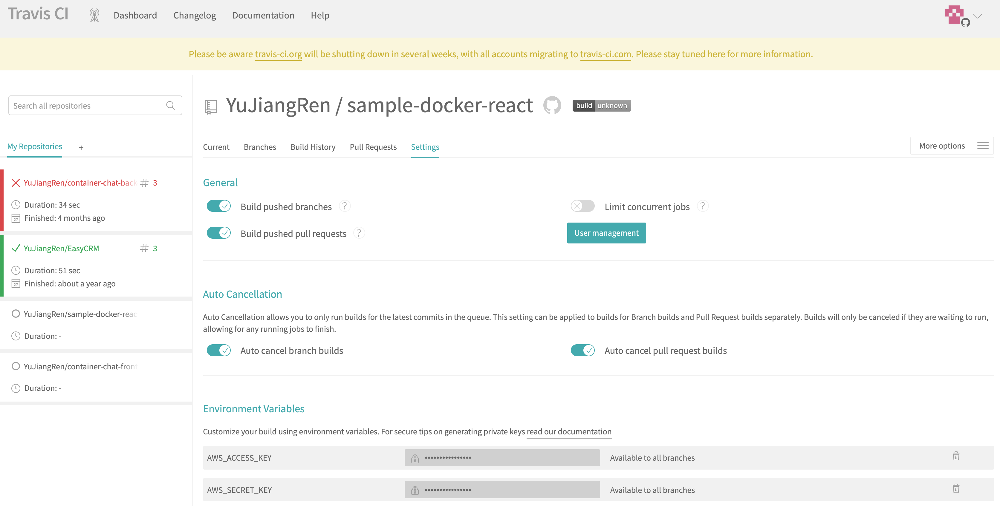

#### Commit Code, Create Pull Request, Push to Repo and Trigger CD Pipeline

Commit the code and push to your repo:

```bash
# Create a new branch and switch to it
git checkout -b add_travis_yaml_file_and_dockerfile

# Check status
git status

# Add all the files
git add .

# Commit
git commit -m "issue/add_travis_yaml_file_and_dockerfile"

# Push to the remote repo
git push

# Create a pull request and merge it
```

#### Trigger the Build

Travis CI will pick up the update in a few seconds and trigger a build. After a successful build, go to your application on AWS and you should see it updated with the new code from Travis, build the Docker image, and start up the application.

In Travis, `sample-docker-react` CI/CD is built automatically after a git push from our local environment to GitHub.

If everything goes well, you will see:
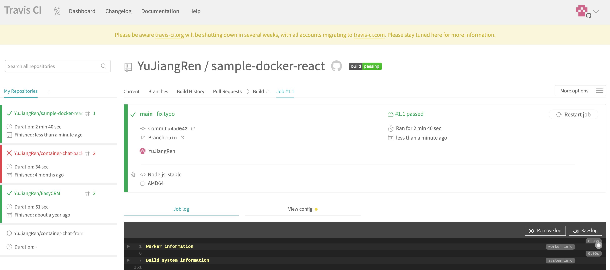

On the AWS console, you will see:


Open the link shown on your AWS Elastic Beanstalk -> applications window:


## Discussion

- What are the key benefits of this approach?
- What are the problems you observe from this approach?

## Extension

- Can you set up a proper URL for your service?
- Can you set up a staging environment and a prod environment?
  - The prod environment should not have auto-triggered deploy; instead, it should have scheduled deployment.
- How would you revert the change if some buggy code is deployed?

## Setting up CI/CD for our CMS project

### Recap

- **Continuous Integration (CI)**

  Continuous Integration is a practice where development teams frequently commit application code changes to a shared repository. These changes automatically trigger new builds, which are then validated by automated testing to ensure that they do not break any functionality.

  

- **Continuous Delivery (CD)**

  Continuous Delivery (CD) focuses on the automation process to release a fully functional build into production.

  

- **Jenkins - Scalability Based on Kubernetes**

  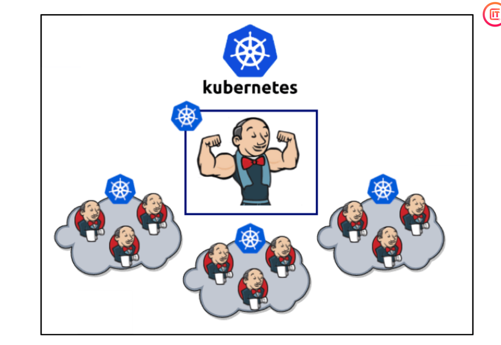

### CI/CD - Practical Example

1. Run Jenkins in a Kubernetes Cluster
2. Install Kubernetes plugin and configure Kubernetes in Jenkins
3. Configure Credentials for Jenkins pipeline
4. Create Elastic Beanstalk environments in AWS
5. Setup GitHub integration

#### Jenkins + Docker

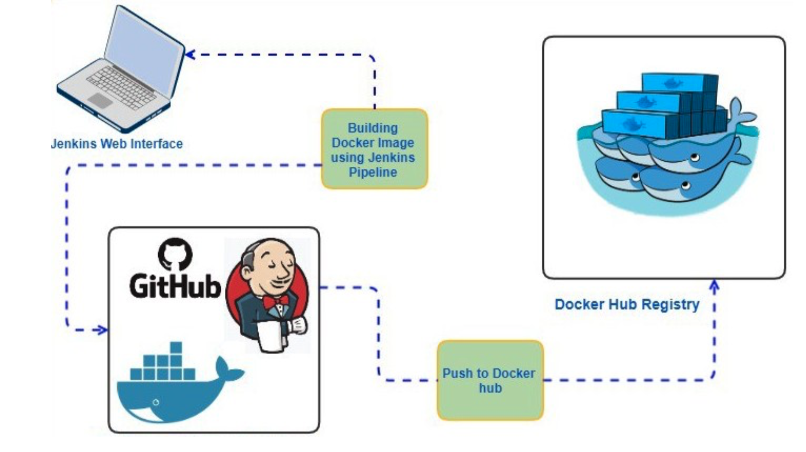

#### Jenkins Based on Kubernetes Cluster

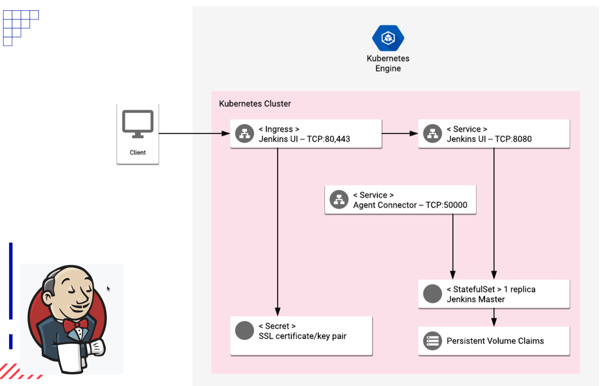

#### Kubernetes Components

A Kubernetes cluster consists of a set of worker machines, called nodes, that run containerized applications. Every cluster has at least one worker node.

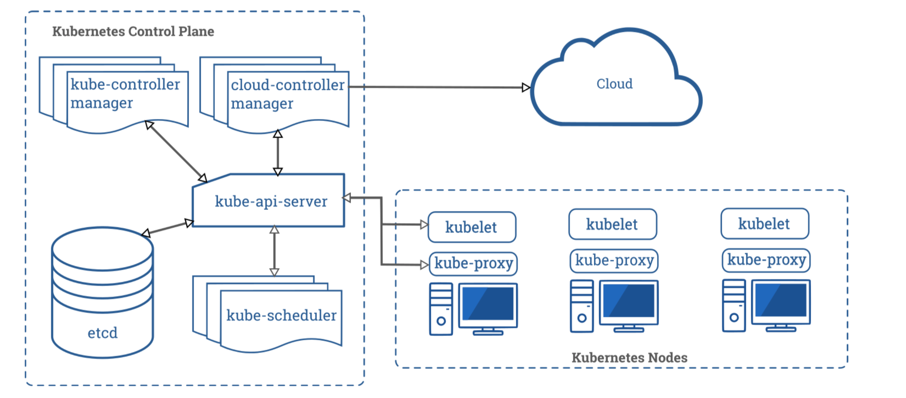

##### Control Plane Components

- **kube-apiserver**: The API server is a component of the Kubernetes control plane that exposes the Kubernetes API. It is the front end for the Kubernetes control plane.

- **etcd**: A consistent and highly-available key-value store used as Kubernetes' backing store for all cluster data.

- **kube-scheduler**: This component watches for newly created Pods with no assigned node and selects a node for them to run on.

- **kube-controller-manager**: This runs controller processes. Logically, each controller is a separate process, but to reduce complexity, they are all compiled into a single binary and run in a single process.

- **cloud-controller-manager**: This embeds cloud-specific control logic, allowing you to link your cluster into your cloud provider's API, separating components that interact with the cloud platform from components that interact with your cluster.

##### Node Components

- **kubelet**: An agent that runs on each node in the cluster, ensuring that containers are running in a Pod.

- **kube-proxy**: A network proxy that runs on each node in your cluster, implementing part of the Kubernetes Service concept.

#### Elastic Beanstalk in AWS

AWS Elastic Beanstalk is a compute service that makes it easier for developers to quickly deploy and manage applications in the AWS cloud. Developers simply upload their application to the AWS cloud, and Elastic Beanstalk provisions and handles the configuration, providing capacity provisioning, load balancing, auto-scaling, and health monitoring.

### Hands-on: Setting Up CI/CD for Our CMS Project

#### Pre-requisites

1. Google Cloud Platform account
2. Run Jenkins in a Kubernetes Cluster

**Install Jenkins in Kubernetes:**
[Install-Jenkins-Kubernetes](https://github.com/JiangRenDevOps/DevOpsLectureNotesV4/tree/main/WK3_CI-CD-Jekins/4.Install-Jenkins-Kubernetes)

#### Hands-on Steps

1. **Config and install plugins for Jenkins and setup AWS environment for CMS project:**
   [Jenkins Plugins and AWS Setup](https://github.com/JiangRenDevOps/DevOpsLectureNotesV4/tree/main/WK3_CI-CD-CMS)

2. **Jenkins configuration for DockerHub:**
   [Jenkins DockerHub Configuration](https://github.com/JiangRenDevOps/DevOpsLectureNotesV4/blob/main/WK3_CI-CD-CMS/DockerHub.md)

3. **Tips for this hands-on:**

   - Change 'https' to 'http' for Jenkins URL when first logging into Jenkins.

     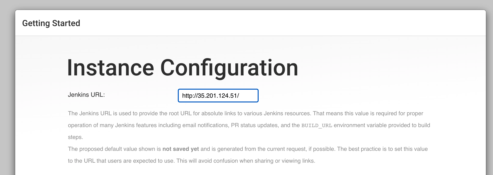

   - Change the image name to your own Docker image name when deploying the JRCMS project to AWS.

     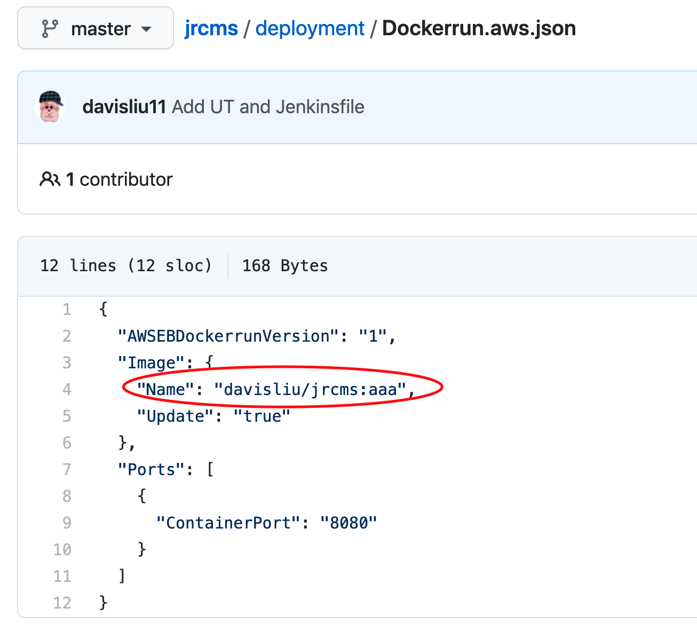
