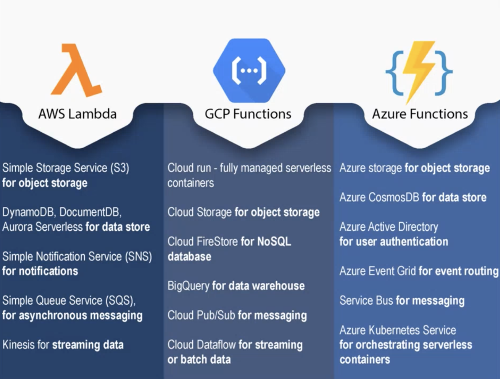
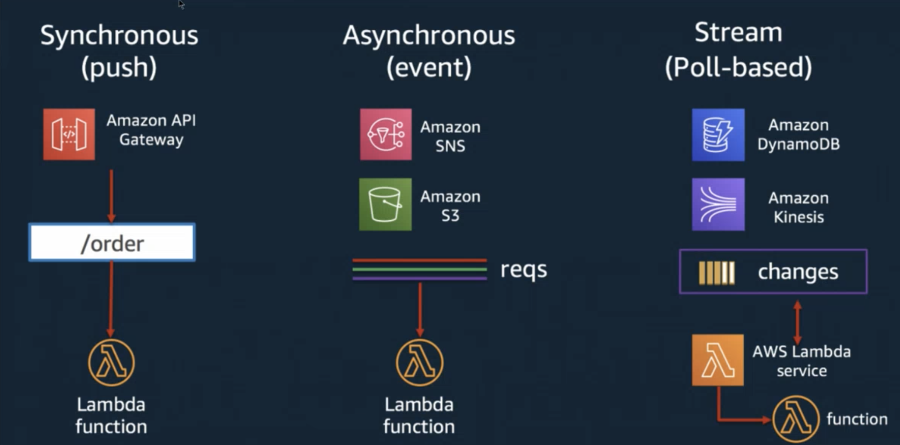
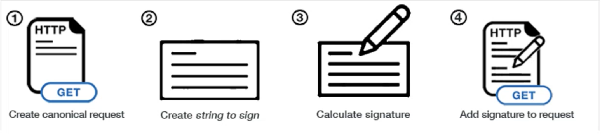

# Serverless and AWS SDK

## 目录

- [Serverless](#serverless)
  - [Overview](#overview)
  - [AWS Lambda: Run Your Code on the Cloud](#aws-lambda-run-your-code-on-the-cloud)
  - [Build a Serverless “Hello, World!”](#build-a-serverless-hello-world)
  - [Use Lambda with Other AWS Services](#use-lambda-with-other-aws-services)
  - [Lambda Permissions](#lambda-permissions)
- [AWS SDK](#aws-sdk)
  - [AWS CLI](#aws-cli)
  - [AWS SDK Overview](#aws-sdk-overview)
  - [AWS SDK for Python](#aws-sdk-for-python)

## Serverless

### Overview

Serverless Architecture Overview:

- Build and run applications without managing infrastructure.

Traditional Infrastructure:

- Teams purchase servers to build and run applications.
- Managing servers takes time and resources:
  - Server hardware costs.
  - Software and security patching.
  - Creating backups in case of failure.

Serverless Pros & Cons:

- **Pros:**
  - Low cost: Charged per invocation, no cost for unused server.
  - Scalability.
  - Productivity.
- **Cons:**
  - Loss of control.
  - Security: Cloud provider might run several customers’ code on the same server simultaneously.
  - Performance impact.
  - Testing.
  - Vendor lock-in.

Serverless: Function as a Service:

- Developers write application code as discrete functions with the following attributes:
  - **Invocation:** A single function execution.
  - **Duration:** Time it takes to execute the function.
  - **Cold start:** Latency when a function is triggered for the first time or after a period of inactivity.
  - **Concurrency limit:** Number of function instances that can run simultaneously in one region.
  - **Timeout:** Maximum time a cloud provider allows a function to run before terminating it.

Serverless Use Cases:

- **Trigger-based tasks:** Any activity that triggers an event or a series of events.
  - Example: User sign-up on a website triggers a database change and a welcome email.
- **Building RESTful APIs.**
- **Asynchronous processing:** Behind-the-scenes tasks like rendering product info or transcoding videos.
- **Security checks.**
- **CI/CD:** Example: Code commit triggers a function to build and run automated tests.

Serverless on Cloud:

### AWS Lambda: Run Your Code on the Cloud

- Write and upload code as a .zip file or container.
- Automatically respond to requests at any scale, up to 10k/s.
  - [Lambda Limits](https://docs.aws.amazon.com/lambda/latest/dg/gettingstarted-limits.html)
- Pay only for the compute time you use, per millisecond.
- Respond in milliseconds with provisioned concurrency.

### Build a Serverless “Hello, World!”

> [Build a Serverless "Hello, World!"](https://github.com/JiangRenDevOps/DevOpsLectureNotesV6/blob/master/WK6_Serverless_AWS_SDK/serverless_hello_world.md)

### Use Lambda with Other AWS Services

- **Invoke your Lambda function on schedule:**
  - [Lambda with Scheduled Events](https://github.com/JiangRenDevOps/DevOpsLectureNotesV6/blob/master/WK6_Serverless_AWS_SDK/lambda_with_scheduled_events.md)
- **Invoke your Lambda function when an object is uploaded to S3:**
  - [Lambda with S3](https://github.com/JiangRenDevOps/DevOpsLectureNotesV6/blob/master/WK6_Serverless_AWS_SDK/lambda_with_s3.md)
- **Invoke your Lambda function for incoming HTTP requests:**
  - [Lambda with API Gateway](https://github.com/JiangRenDevOps/DevOpsLectureNotesV6/blob/master/WK6_Serverless_AWS_SDK/lambda_with_api_gw.md)

### Lambda Permissions

- Use Lambda execution roles (IAM policy) to manage Lambda permissions.
  - [Lambda Execution Role](https://docs.aws.amazon.com/lambda/latest/dg/lambda-intro-execution-role.html)
- Develop AWS Lambda using the Serverless Framework.
  - [Serverless Framework Docs](https://www.serverless.com/framework/docs/getting-started) > [Python Example](https://github.com/serverless/examples/blob/master/aws-python/serverless.yml)

## AWS SDK

### AWS CLI

- The AWS Command Line Interface (CLI) is an open-source tool that enables interaction with AWS services using commands in your command-line shell.
- Installation, configuration, and authentication:
  - [DevOps Initial Setup](https://github.com/JiangRenDevOps/DevOpsLectureNotesV6/blob/master/WK0_General/devops-initial-setup.md)
  - [AWS CLI QuickStart](https://docs.aws.amazon.com/cli/latest/userguide/cli-configure-quickstart.html)

**QuickStart:**

- **EC2:** Launch, list, and terminate Amazon EC2 instances.
  - [CLI EC2](https://github.com/JiangRenDevOps/DevOpsLectureNotesV6/blob/master/WK6_Serverless_AWS_SDK/cli_ec2.md)
- **S3:** Create, list, and delete S3 buckets.
  - [CLI S3](https://github.com/JiangRenDevOps/DevOpsLectureNotesV6/blob/master/WK6_Serverless_AWS_SDK/cli_s3.md)

### AWS SDK Overview

- Tools for developing and managing applications on AWS:
  - [AWS Tools](https://aws.amazon.com/tools/)
- **SDK:** Software Development Kit. A collection of software development tools in one installable package.

**Without SDK:**

- Each action on AWS is implemented via API calls. Without an SDK, you need to sign your API request by generating signatures.
  
  - [Signing AWS API Requests](https://docs.aws.amazon.com/general/latest/gr/signing_aws_api_requests.html)

### AWS SDK for Python

- Use Python (Boto3) to create, configure, and manage AWS resources.
- Installation, configuration, and authentication:
  - [DevOps Initial Setup](https://github.com/JiangRenDevOps/DevOpsLectureNotesV6/blob/master/WK0_General/devops-initial-setup.md)
  - [Boto3 QuickStart](https://boto3.amazonaws.com/v1/documentation/api/latest/guide/quickstart.html#configuration)

**QuickStart:**

- **Use Boto3 with AWS SQS:**
  - [Boto3 SQS](https://github.com/JiangRenDevOps/DevOpsLectureNotesV6/blob/master/WK6_Serverless_AWS_SDK/boto3_sqs.md)
- **Use Boto3 with AWS DynamoDB:**
  - [Boto3 DynamoDB](https://github.com/JiangRenDevOps/DevOpsLectureNotesV6/blob/master/WK6_Serverless_AWS_SDK/boto3_dynamo.md)
