# Infrastructure as Code (IaC) with Terraform

## 目录

- [Infrastructure as Code and Tools](#infrastructure-as-code-and-tools)
  - [What is Infrastructure as Code](#what-is-infrastructure-as-code)
  - [What is "Infrastructure"?](#what-is-infrastructure)
  - [Infrastructure in AWS](#infrastructure-in-aws)
  - [Problems IaC Can Solve](#problems-iac-can-solve)
- [Terraform Overview](#terraform-overview)
  - [What is Terraform](#what-is-terraform)
  - [Terraform CLI](#terraform-cli)
- [Terraform Basic Concepts](#terraform-basic-concepts)
  - [The Language (HCL)](#the-language-hcl)
  - [Planning & Applying](#planning-applying)
  - [State](#state)
  - [Dependency Resolution](#dependency-resolution)
  - [File Structure](#file-structure)
  - [Providers](#providers)
  - [Variables](#variables)
  - [Output](#output)
- [Terraform Hands-on](#terraform-hands-on)
- [Homework](#homework)

## Infrastructure as Code and Tools

### What is Infrastructure as Code

- **Definition:** Write code to represent your infrastructure requirements and use an IaC tool to apply those changes to your cloud/on-prem environment.
- **Advantages:**
  - Static description and dynamic management.
  - Version control and traceability of infrastructure state at any given time.
  - Automation and consistency.

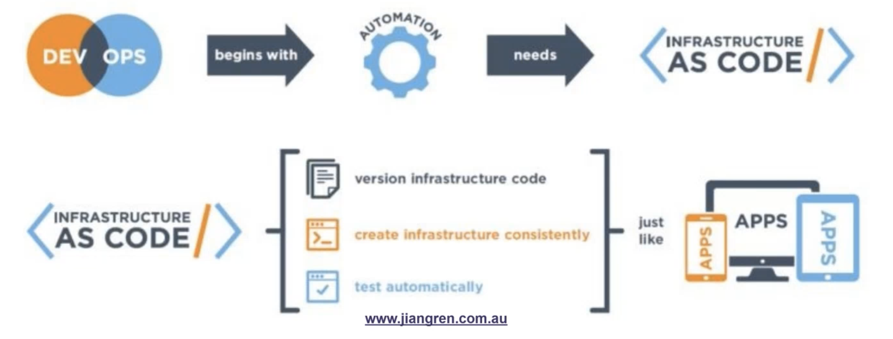

### What is "Infrastructure"?

- **Non-cloud infrastructure:** Laptops, on-prem servers.
- **Cloud infrastructure:** AWS, Azure, GCP, etc.

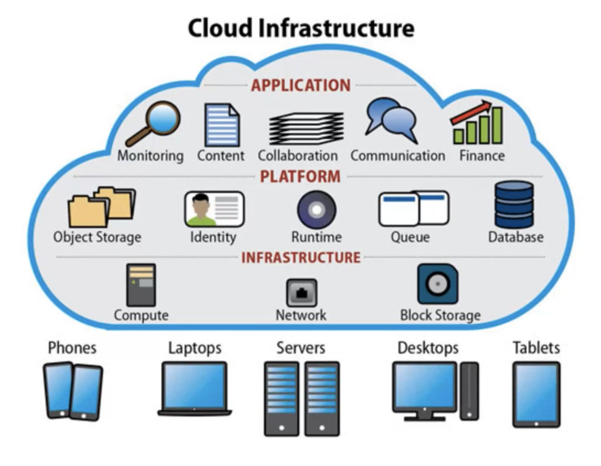

### Infrastructure in AWS

- **Components:** EC2 instances, RDS databases, S3 buckets, VPCs, etc.

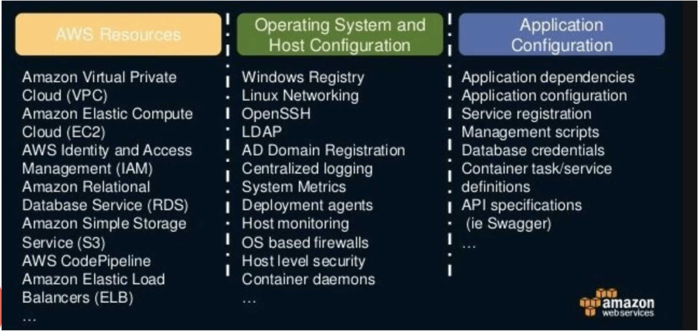

### Problems IaC Can Solve

- **Resource Management:** Create, update, and destroy infrastructure resources (e.g., databases, storage).
- **Application Deployment:** Deploy and update applications on top of the infrastructure.
- **Configuration Management:** Manage application configurations to ensure consistency and automation, reducing human error and effort.

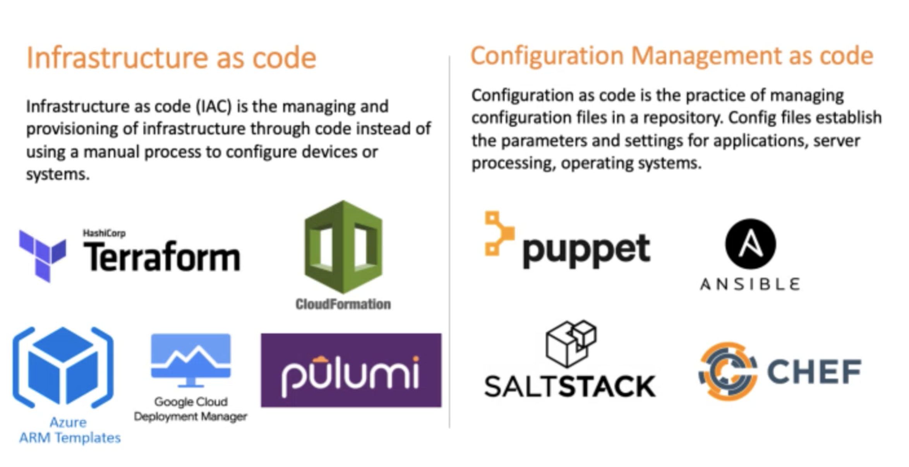

## Terraform Overview

### What is Terraform

- **Definition:** Terraform is an Infrastructure as Code (IaC) tool that allows you to script the creation, updating, and deletion of (mainly) cloud resources.
- **Creator:** HashiCorp, which also owns Vagrant, Packer, Consul, Vault, etc.
- **Use Case:** Multi-cloud infrastructure management.

### Terraform CLI

- **Characteristics:**
  - Client-based standalone application.
  - Vendor-agnostic.
  - Declarative configuration language.
  - Written in Golang.
  - Open source.
  - Uses its own syntax: HashiCorp Configuration Language (HCL).

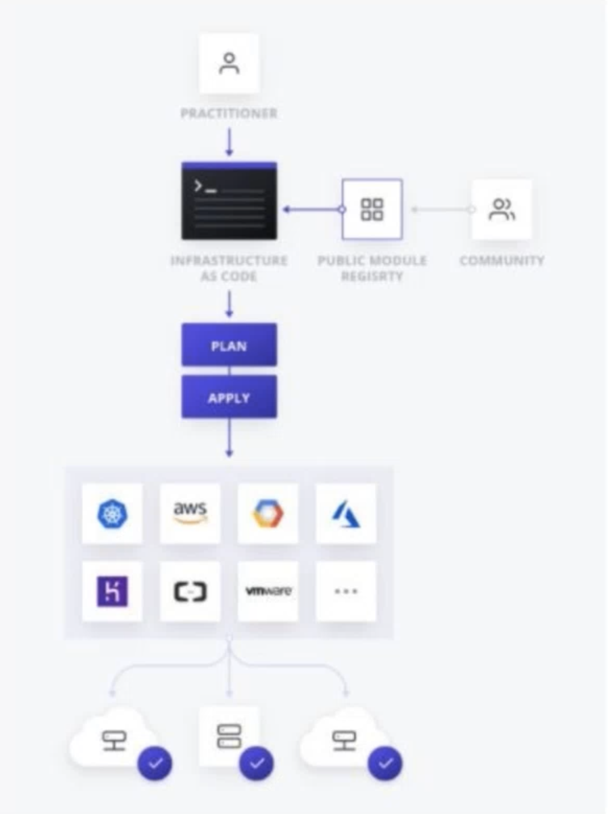

#### Tiny Terraform Example

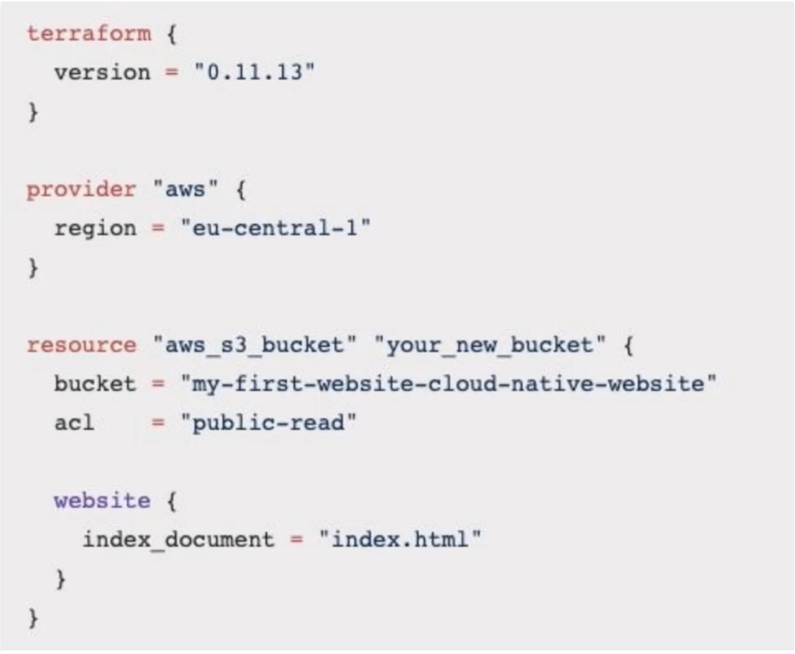

## Terraform Basic Concepts

### The Language (HCL)

- **Definition:** HashiCorp Configuration Language (HCL) is used to define infrastructure resources in Terraform.
- **Resource Reference Syntax:**

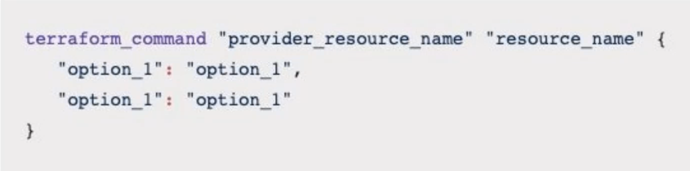
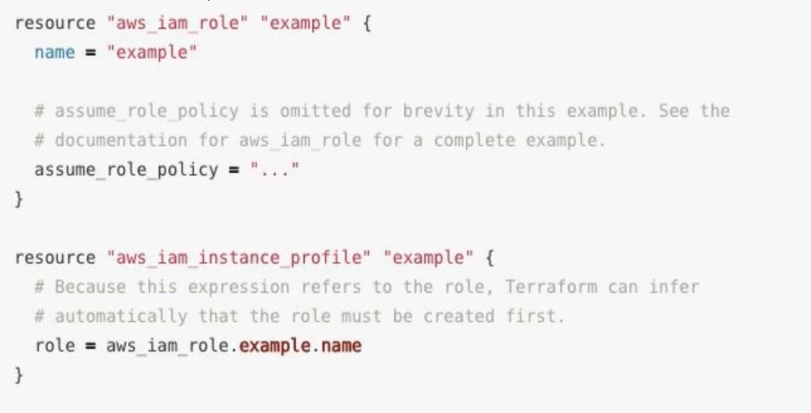

### Planning & Applying

- **Commands:**
  - `terraform init`: Initialize a working directory containing Terraform configuration files.
  - `terraform plan`: Create an execution plan to reach the desired state of the configuration.
  - `terraform apply`: Execute the actions proposed in a Terraform plan.
- **Cycle:** The plan and apply steps can be repeated to continually update and manage the infrastructure.

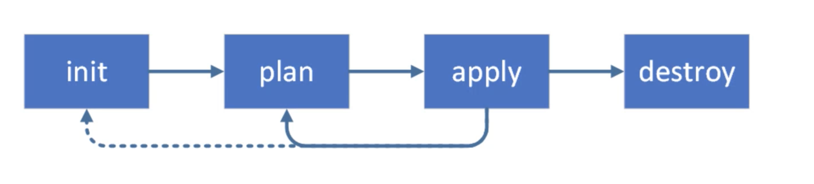

### State

- **Purpose:** Tracks the state of infrastructure managed by Terraform.
- **State File:** Updated after every operation to reflect the current state of resources.

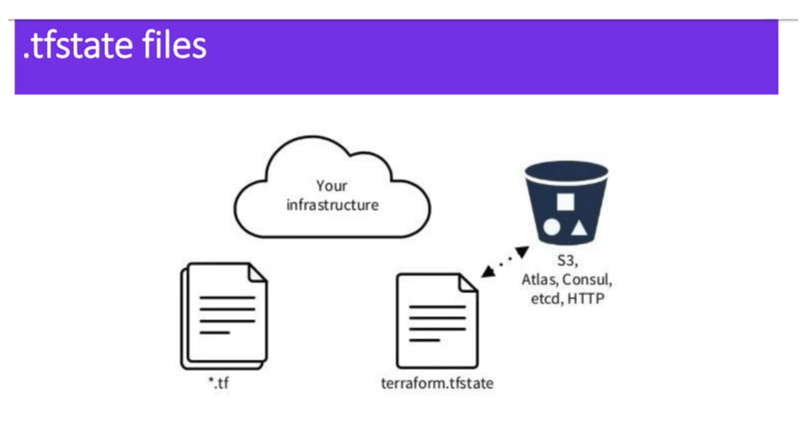

### Dependency Resolution

- **Purpose:** Terraform resolves dependencies between resources to ensure proper order of operations.
- **Visualization:** Use tools like Graphviz to generate a visual representation of the configuration plan.

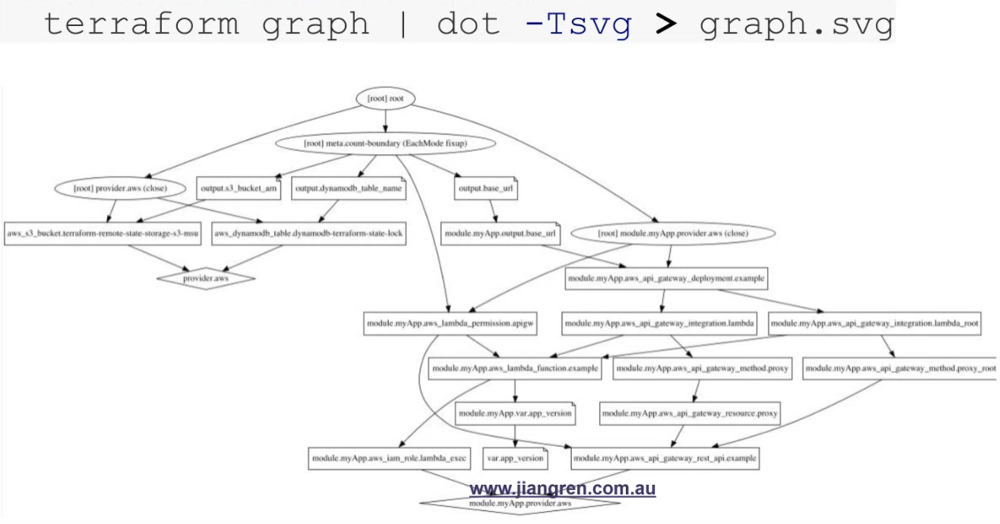
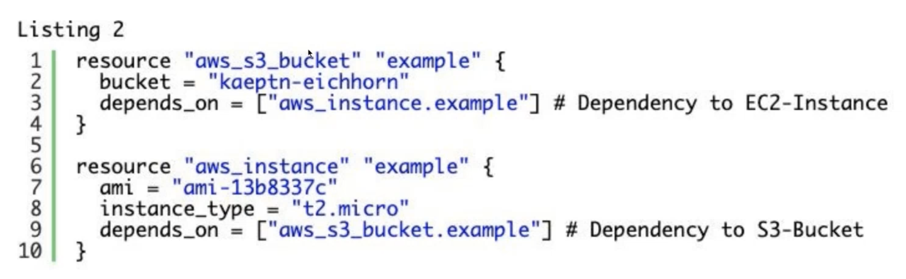

### File Structure

- **Convention:** All `.tf` files in the current directory are automatically imported.
- **Common Practice:** Have a `main.tf` as the entry point and organize configurations in subdirectories if needed.

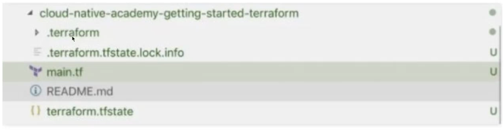

### Providers

- **Definition:** Providers are plugins that interact with various APIs and services (e.g., AWS, Azure).
- **Configuration:** Specified in the `main.tf` file.
- **Documentation:** [Terraform Providers](https://www.terraform.io/docs/providers/)

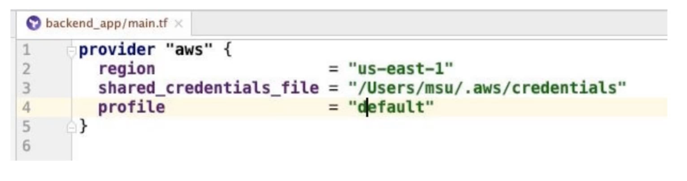
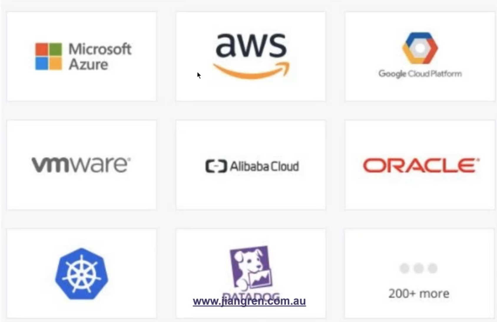

### Variables

- **Purpose:** Define and reference variables to manage multiple environments (e.g., dev, prod).
- **Example:**

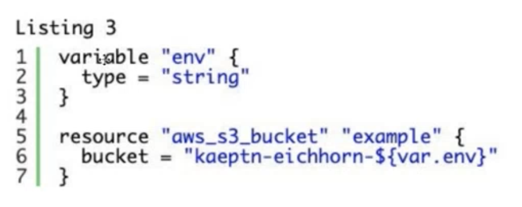

### Output

- **Purpose:** Define outputs to display useful information after running Terraform.
- **Example:**

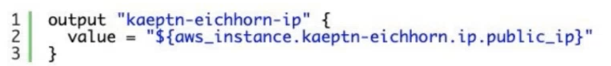

## Terraform Hands-on

- **Examples:**
  - S3, Lambda, Gateway API.
  - Modules and variables.
  - Collaboration problem.

> [Terraform Hands-on](https://github.com/JiangRenDevOps/DevOpsLectureNotesV6/tree/master/WK6_Terraform/hands_on)
