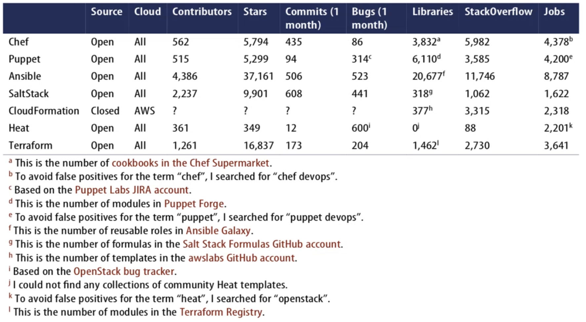
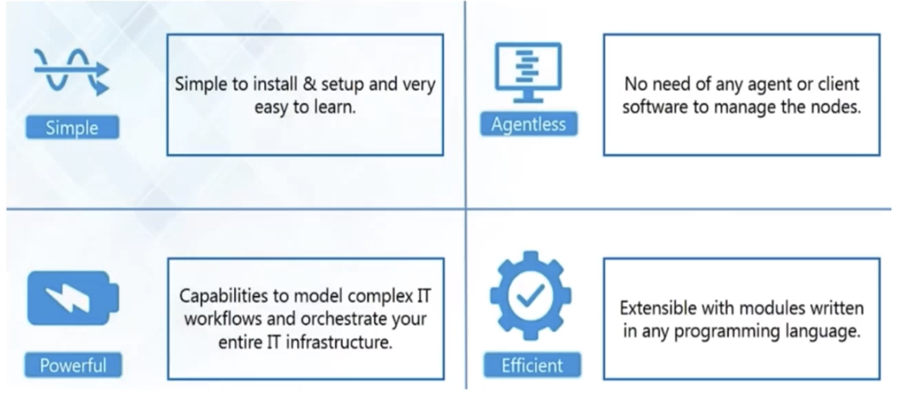
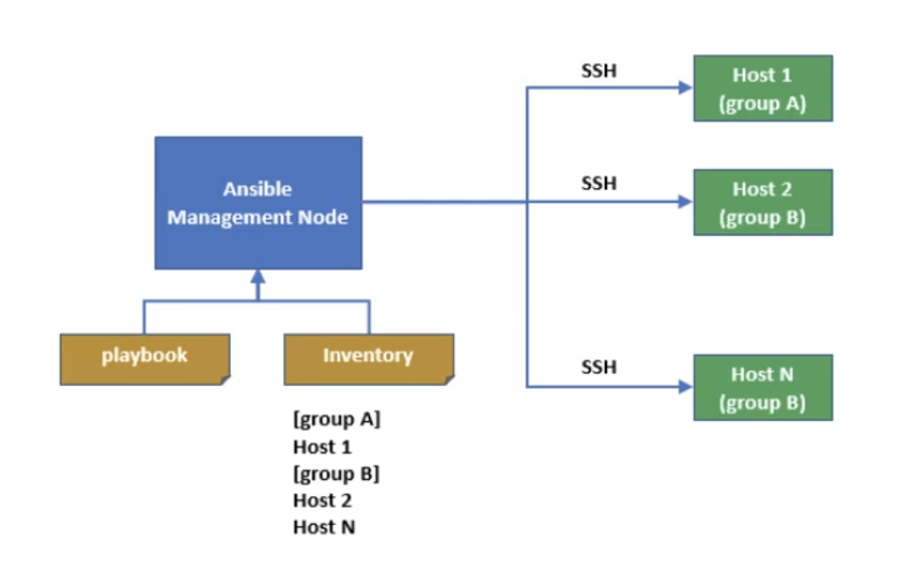
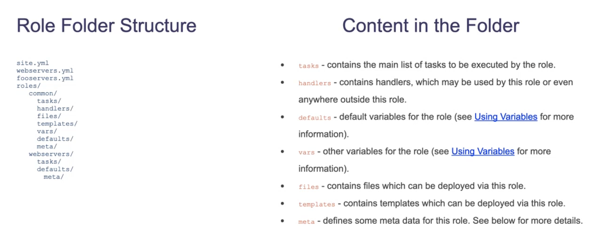
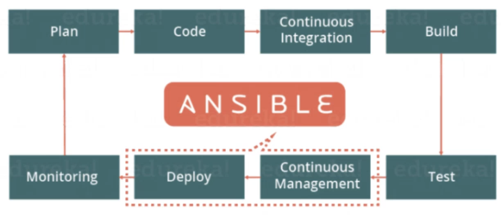
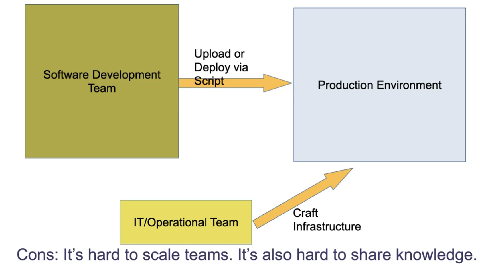
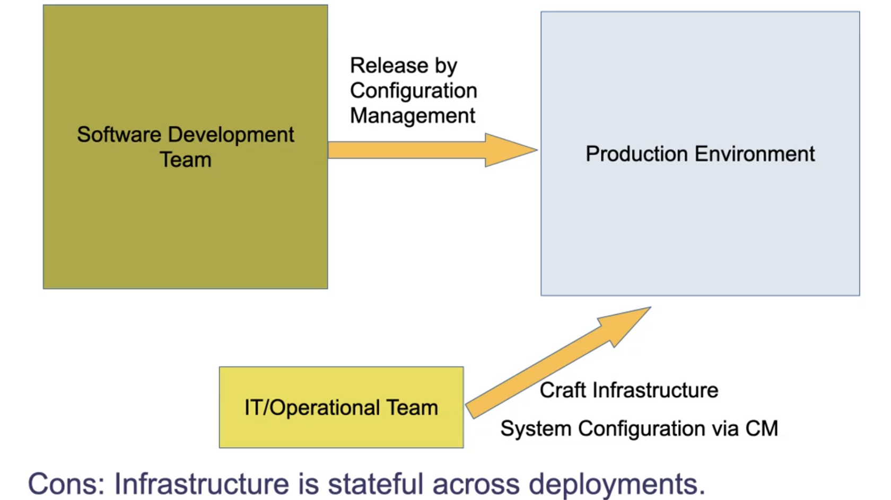
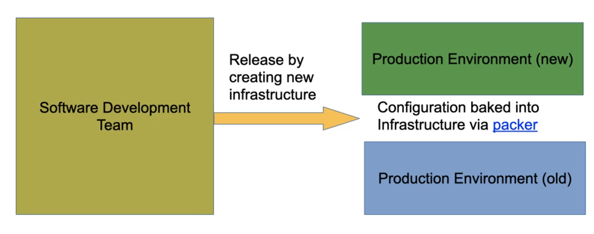
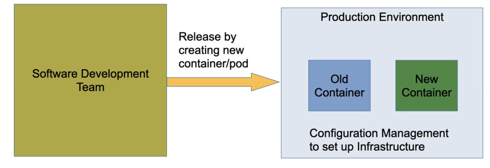
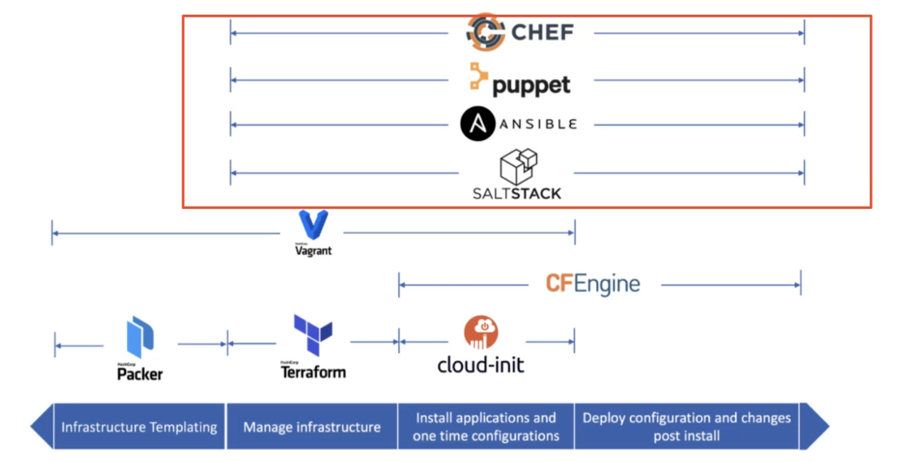

# Configuration Management (CM) with Ansible & Packer

## 目录

- [Configuration Management Overview](#configuration-management-overview)
  - [Manual Configuration](#manual-configuration)
  - [Evolution: Script](#evolution-script)
  - [Idempotence](#idempotence)
  - [Evolution of Configuration Management](#evolution-of-configuration-management)
- [CM Big 4](#cm-big-4)
  - [CM Big 4 Overview](#cm-big-4-overview)
  - [CM & IA Tools Statistics](#cm--ia-tools-statistics)
- [Ansible Overview](#ansible-overview)
  - [What is Ansible?](#what-is-ansible)
  - [Why Ansible](#why-ansible)
  - [Ansible Idempotency](#ansible-idempotency)
  - [How Ansible Works](#how-ansible-works)
  - [Ansible Roles](#ansible-roles)
  - [Ansible Galaxy](#ansible-galaxy)
  - [Frequently Used Ansible Commands](#frequently-used-ansible-commands)
  - [Ansible in DevOps](#ansible-in-devops)
  - [Software Delivery Focus Evolution](#software-delivery-focus-evolution)
  - [Choosing the Right Tool](#choosing-the-right-tool)
- [Ansible Hands-on](#ansible-hands-on)

## Configuration Management Overview

In DevOps, Configuration Management (CM) automates the process of managing all the configurations of the environments that host software applications.

### Manual Configuration

- **Process:** SSH into servers and configure manually.
- **Cons:**
  - Unreliable for complex configurations.
  - No records of changes.
  - No review process.

### Evolution: Script

- **Process:** From documentation to code using bash, perl, ruby, python.
- **Benefits:** Automates repetitive tasks, reduces human error.

### Idempotence

- **Definition:** Multiple operations result in the same outcome.
- **Example:**

```bash
echo "hello world" > /tmp/file  # Overwrites content
echo "hello world" >> /tmp/file # Appends content
```

- **Challenge:** Ensuring configurations reach the desired state regardless of the initial state.

### Evolution of Configuration Management

- **Framework:** Use a configuration management framework.
- **Benefits:**
  - Reduce complexity.
  - Manage multiple servers.

## CM Big 4

### CM Big 4 Overview

- **Declarative:** Specifies _what_ to do.
  - Ensures idempotence.
- **Imperative:** Specifies _how_ to do it.
  - Results can vary based on initial state.

### CM & IA Tools Statistics



## Ansible Overview

### What is Ansible?

Ansible is an open-source configuration management, deployment, and orchestration tool developed by RedHat.



### Why Ansible

- **Pros:**
  - Easy to use/learn.
  - Low infrastructure maintenance (no master, agent).
- **Cons:**
  - Configuration file cannot always determine the final state.
  - Base system status affects results.
  - Order of execution affects the outcome.

### Ansible Idempotency

- **Ensuring Idempotency:**
  - Techniques to make non-idempotent tasks idempotent.
  - Resources:
    - [Medium article on idempotency](https://medium.com/opsops/forces-idempotency-in-ansibledc7ce366a276)
    - [Anand-yyhs article](https://anand-yyhs.medium.com/how-to-make-a-non-idempotenttask-an-idempotent-task-in-ansible-dbe4b175ae8)

### How Ansible Works



- **Inventory:** Lists managed nodes.
- **SSH:** Pre-configured to control managed nodes.
- **Playbook:** YAML configuration files.
- **Plugins:** Extend Ansible's automation engine.
- **Modules:** Group functionalities for managed nodes.

### Ansible Roles



### Ansible Galaxy

- **Definition:** A shared repository of Ansible roles.
- **Examples:**
  - [Docker Role](https://galaxy.ansible.com/geerlingguy/docker)
  - [Java Role](https://galaxy.ansible.com/geerlingguy/java)
  - [Nginx Role](https://galaxy.ansible.com/geerlingguy/nginx)
- **Usage:** [Ansible Galaxy CLI](https://docs.ansible.com/ansible/latest/cli/ansible-galaxy.html)

### Frequently Used Ansible Commands

```bash
# Adhoc execution
ansible <group> -m <module> -a <arguments>
e.g. ansible all -m ping
e.g. ansible web -m reboot
e.g. ansible db -m setup

# Run a playbook
ansible-playbook playbook.yml

# Install roles from Ansible Galaxy
ansible-galaxy install romoterole

# Install roles from Git
ansible-galaxy install git+https://github.com/geerlingguy/ansible-role-apache.git

# Create a role
ansible-galaxy init myrole

# List installed roles
ansible-galaxy list
```

### Ansible in DevOps



### Software Delivery Focus Evolution

**No Configuration Management**



**Mutable Infrastructure**



**Immutable Infrastructure**



**Immutable Container/Pod**



**Do we still need Configuration Management?**

Yes, configuration management tools like Ansible are essential even with containerization, especially for companies not yet utilizing container technologies.

### Choosing the Right Tool



## Ansible Hands-on

[Ansible Hands-on Exercises](https://github.com/JiangRenDevOps/DevOpsLectureNotesV6/tree/master/WK7_CM_Ansible_Packer)
