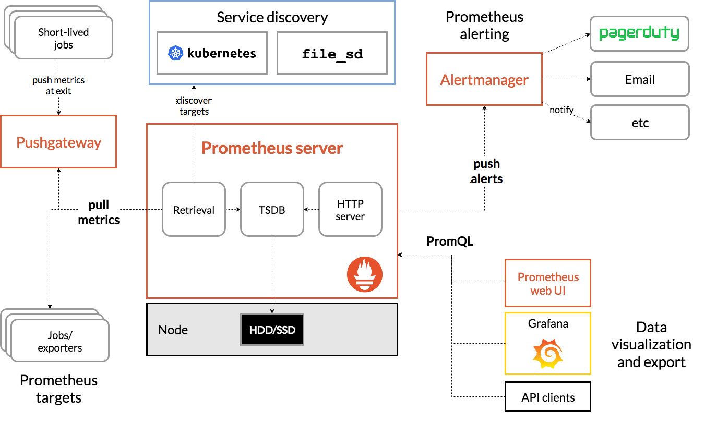
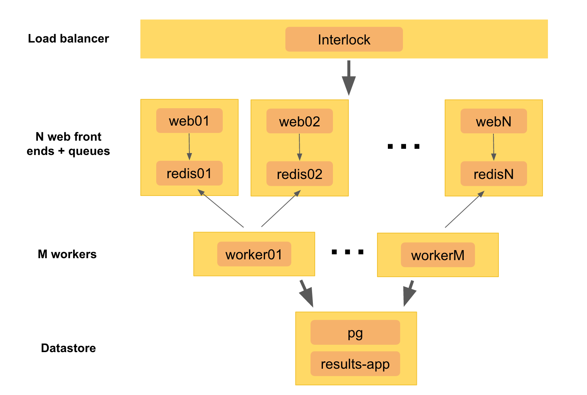

# Monitoring in DevOps - I

## 目录

- [Prometheus](#prometheus)
  - [Metric Names and Labels](#metric-names-and-labels)
  - [Samples](#samples)
  - [Notation](#notation)
  - [Configuring Prometheus](#configuring-prometheus)
  - [Hands-on](#hands-on)
- [Metrics and Metric Types](#metrics-and-metric-types)
- [Statsd](#statsd)
- [Grafana](#grafana)
- [Monitoring Basics](#monitoring-basics)
  - [What is Monitoring?](#what-is-monitoring)
  - [Monitoring Types](#monitoring-types)
  - [Why Monitor?](#why-monitor)
- [SRE - 4 Golden Signals](#sre---4-golden-signals)
  - [Latency](#latency)
  - [Traffic](#traffic)
  - [Errors](#errors)
  - [Saturation](#saturation)
- [Symptoms Versus Causes](#symptoms-versus-causes)
  - [Problem Statement Approach](#problem-statement-approach)
  - [Workload Characterization Approach](#workload-characterization-approach)
  - [The USE Approach](#the-use-approach)
- [Other Tips](#other-tips)

## Prometheus



Prometheus fundamentally stores all data as time series: streams of timestamped values belonging to the same metric and the same set of labeled dimensions. Besides stored time series, Prometheus may generate temporary derived time series as the result of queries.

## Metric Names and Labels

Every time series is uniquely identified by its metric name and optional key-value pairs called labels. Labels help identify specific information about the metrics.

The metric name specifies the general feature of a system that is measured (e.g. `http_requests_total` - the total number of HTTP requests received). It may contain ASCII letters, digits, underscores, and colons. It must match the regex `[a-zA-Z_:][a-zA-Z0-9_:]*`.

## Samples

Samples form the actual time series data. Each sample consists of:

- A float64 value
- A millisecond-precision timestamp

## Notation

Given a metric name and a set of labels, time series are frequently identified using this notation:

```
<metric name>{<label name>=<label value>, ...}
```

For example, a time series with the metric name `api_http_requests_total` and the labels `method="POST"` and `handler="/messages"` could be written like this:

```
api_http_requests_total{method="POST", handler="/messages"}
```

## Configuring Prometheus

```yaml
global:
  scrape_interval: 15s
  evaluation_interval: 15s

rule_files:
  # - "first.rules"
  # - "second.rules"

scrape_configs:
  - job_name: prometheus
    static_configs:
      - targets: ["localhost:9090"]
```

### Configuration Blocks

1. **Global**: Controls the Prometheus server's global configuration.

   - `scrape_interval`: How often Prometheus scrapes targets (default 15s).
   - `evaluation_interval`: How often Prometheus evaluates rules (default 15s).

2. **Rule Files**: Specifies the location of rules for Prometheus to load.

   - Recording rules precompute frequently needed or computationally expensive expressions.

3. **Scrape Configs**: Controls what resources Prometheus monitors.
   - The default configuration scrapes Prometheus' own metrics from `localhost:9090`.

### Hands-on

For detailed hands-on exercises, refer to the [Prometheus hands-on guide](https://github.com/JiangRenDevOps/DevOpsLectureNotesV6/blob/master/WK7_Monitoring/docs/01.prometheus.md).

## Metrics and Metric Types

For more information, refer to the [Metrics and Metric Types documentation](https://github.com/JiangRenDevOps/DevOpsLectureNotesV6/blob/master/WK7_Monitoring/docs/02.metrics.md).

## Statsd

For details on Statsd, refer to the [Statsd documentation](https://github.com/JiangRenDevOps/DevOpsLectureNotesV6/blob/master/WK7_Monitoring/docs/03.statsd.md).

## Grafana

Grafana is used to display metrics stored in Prometheus. For more details, refer to the [Grafana documentation](https://github.com/JiangRenDevOps/DevOpsLectureNotesV6/blob/master/WK7_Monitoring/docs/04.grafana.md).

**Note**: Prometheus is a time series database for storing and recording data, while Grafana is used for visualization.

## Monitoring Basics

In SRE interviews, you might be asked about monitoring and troubleshooting latency issues in a system.



### What is Monitoring?

Monitoring involves collecting, processing, aggregating, and displaying real-time quantitative data about a system, such as query counts, error counts, processing times, and server lifetimes.

### Monitoring Types

1. **White-box Monitoring**: Based on metrics exposed by the internals of the system, such as logs or HTTP endpoints.

   - Tools: Prometheus + Grafana, Datadog, SignalFx
   - Log Monitoring: Kibana, Splunk

2. **Black-box Monitoring**: Testing externally visible behavior as a user would see it.
   - Synthetic Monitoring: Selenium Webdriver, Cypress, New Relic
   - Load-testing: Gatling, Locust

### Why Monitor?

- **Analyzing long-term trends**: Understand growth, user behavior, and potential issues.
- **Comparing over time or experiment groups**: Measure performance improvements or regressions.
- **Alerting**: Notify when something breaks or might break soon.
- **Building dashboards**: Visualize the state of your services.
- **Debugging**: Identify and troubleshoot issues when they arise.

## SRE - 4 Golden Signals

### Latency

The time it takes to serve a request.

**Visibility**: Helps identify specific issues by examining various factors such as backend latency, database time, frontend latency, etc.

### Traffic

A measure of the demand on your system.

- Network In/Out
- HTTP Request Rate
- Transactions per second

### Errors

The rate of requests that fail.

- Error rate calculation: `Error rate = Error / (Error + Success)`
- Important metrics: 5xx Error Rate, 4xx Error Rate, Dead Letter Queue size

### Saturation

How "full" your service is.

- System Level: CPU, Memory, Disk, I/O utilization
- Application Level: Thread Pool, Message Queue saturation

## Symptoms Versus Causes

Your monitoring system should address two questions: what’s broken, and why?

### Problem Statement Approach

1. What makes you think there is a performance problem?
2. Has this system ever performed well?
3. What has changed recently?
4. Can the performance degradation be expressed in terms of latency or run time?
5. Does the problem affect other people or applications?
6. What is the environment?

### Workload Characterization Approach

1. Who is causing the load?
2. Why is the load caused?
3. What is the load?
4. How is the load changing over time?

### The USE Approach

1. **Utilization**: Busy time
2. **Saturation**: Queue length or queued time
3. **Errors**: Error logs

## Other Tips

- Choose an appropriate resolution for measurements.
- Most alerts are caused by changes in the system; double-check them.
- Use logs to locate problems but rely on metrics as indicators.
- Understand SLI, SLO, and SLA for long-term monitoring.
- Recognize trends between system metrics and application performance.
