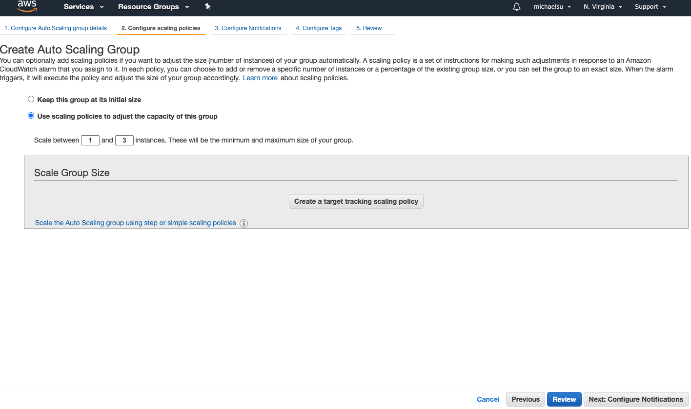

# High Availability with AWS

## 目录

- [Creating a Three-Tier Architecture in AWS](#creating-a-three-tier-architecture-in-aws)
- [Workshop Purpose](#workshop-purpose)
- [Prerequisite](#prerequisite)
- [Prepare Parameters for CFN](#prepare-parameters-for-cfn)
  - [Create one VPC and two subnets](#create-one-vpc-and-two-subnets)
  - [Configure user key pair](#configure-user-key-pair)
  - [Configure Security Group](#configure-security-group)
  - [Configure CFN to use parameters](#configure-cfn-to-use-parameters)
  - [Examine what has been created by CFN](#examine-what-has-been-created-by-cfn)
- [Add Auto Scaling Group in Web Tier](#add-auto-scaling-group-in-web-tier)
  - [Create Launch Template](#create-launch-template)
  - [Create ASG](#create-asg)
  - [Add ASG policy](#add-asg-policy)
- [Recreate on App Tier](#recreate-on-app-tier)
  - [Create 2 private subnets](#create-2-private-subnets)
  - [Create a private route table](#create-a-private-route-table)
  - [Create a NAT gateway](#create-a-nat-gateway)
  - [Create ALB in App Tier](#create-alb-in-app-tier)
  - [Create ASG in App Tier](#create-asg-in-app-tier)
  - [Bastion Host](#bastion-host)
- [Create DB Tier](#create-db-tier)
  - [Create RDS in DB Tier](#create-rds-in-db-tier)
- [Other References](#other-references)
- [CFN-multi-tier-app.yaml](#cfn-multi-tier-appyaml)

## Creating a Three-Tier Architecture in AWS

A three-tier architecture is a software architecture pattern where the application is broken down into three logical tiers: the presentation layer, the business logic layer, and the data storage layer.

This architecture is used in a client-server application such as a web application that has the frontend, the backend, and the database. Each of these layers or tiers does a specific task and can be managed independently of each other.

This is a shift from the monolithic way of building an application where the frontend, the backend, and the database are both sitting in one place.


### Benefits

- **Modularity**: Each part can be managed independently, allowing teams to focus on different tiers and recover quickly from unexpected disasters by focusing on the faulty part.
- **Scalability**: Each tier can scale horizontally to support traffic and request demand. This can be done by adding more EC2 instances to each tier and load balancing across them.
- **High Availability**: By hosting applications in different geographical locations (availability zones), the infrastructure can be highly available.
- **Fault Tolerance**: Redundant systems help the infrastructure adapt to unexpected changes in traffic and faults.
- **Security**: The infrastructure is designed to be highly secure, avoiding exposing interactions over the internet. The frontend, backend, and database tiers communicate internally using private IPs, and security groups limit access.

## Workshop Purpose

- Practise auto-scaling and availability in AWS.
- Gain hands-on experience with AWS fundamentals.

## Prerequisite

Ensure you have an AWS account.

**Warning**:

- This is a heavy workshop, and you may get lost the first time, but you'll get used to it soon.
- Select an availability zone near you, e.g., Asia Pacific (Sydney) ap-southeast-2.
- This workshop may incur some costs. Watch the teacher if you're not prepared to spend money.
- At the end of this tutorial, stop and delete all resources to avoid charges.

## Prepare Parameters for CFN

We will use CloudFormation to create the initial architecture from a dummy app in AWS.

Refer to `./hands_on/CFN-multi-tier-app.yaml`.

**Tip**: Click "View in Designer" to check it out.

### Create One VPC and Two Subnets

- **Setup the Virtual Private Cloud (VPC)**:
  - [AWS VPC](https://console.aws.amazon.com/vpc/home?region=ap-southeast-2#vpcs:sort=desc:VpcId)
  - Create a VPC with a CIDR block of `10.0.0.0/16`.


- Enable public DNS domain:

  - [AWS VPC DNS Support](https://docs.aws.amazon.com/vpc/latest/userguide/vpc-dns.html#vpc-dns-support)
    

- **Setup the Internet Gateway**:
  - Create and attach an Internet Gateway to the VPC.


- **Create Two Subnets**:
  - [AWS Subnets](https://console.aws.amazon.com/vpc/home?region=ap-southeast-2#subnets:sort=desc:tag:Name)
  - Both subnets are public with CIDR blocks within the VPC CIDR range (e.g., `10.0.1.0/24` and `10.0.0.0/24`).


- **Create a Public Route Table**:
  - Route traffic to the internet through the Internet Gateway.
  - Associate this route table with your two public subnets.


### Configure User Key Pair

Ensure you have a user key pair to access your EC2 instances:

- [AWS Key Pairs](https://console.aws.amazon.com/ec2/v2/home?region=ap-southeast-2#KeyPairs:sort=keyName)

### Configure Security Group

- Create a Security Group for EC2 instances with SSH and HTTP allowed as inbound rules.


### Configure CFN to Use Parameters

- Create a stack in AWS CloudFormation using the template in `./hands_on/CFN-multi-tier-app.yaml`.


- Fill in the parameters and create the stack.


### Examine What Has Been Created by CFN

- Check the resources in CFN.


- Inspect each resource in the console.
- Access the Load Balancer in the browser.


You should see:


- Access the web server in the browser by finding the public IP from EC2 services.


You should see:


- Remove `multi-tier-ec2-sg` from the web EC2 instances to ensure they are not open to the public.
- Access the app server in the browser at `http://<app instance public ip>:8080`.

  **Q**: What is the result? Do you know why? How can you access it?

### Inspect the Architecture

**Good Highlights**:

- Load Balancer backed by 2 web-tier EC2 instances running Apache.
- Web-tier EC2 instances are in different availability zones.
- Security:
  - VPC and 2 subnets
  - Web-tier EC2s are only accessible via Load Balancer.
  - App-tier is not exposed publicly.

**Bad Highlights**:

- Two web servers may not handle high load.
- Single point of failure in App server.
- App server lives in a public subnet.
- No DB layer.

## Add Auto Scaling Group in Web Tier

We currently have 2 instances running, which may not handle user load. We'll create an Auto Scaling Group (ASG) to handle load automatically.

### Create Launch Template

Use a new Launch Template before creating ASG:

- [AWS Launch Template](https://console.aws.amazon.com/ec2/v2/home?region=ap-southeast-2#CreateTemplate:)

**Benefits of Launch Template**:

1. No need to specify configurations repeatedly.
2. Version control.

[More on Launch Template](https://docs.aws.amazon.com/AWSEC2/latest/UserGuide/ec2-launch-templates.html)

- **Create a Launch Template**:
  - Use a Free Tier AMI: Amazon Linux 2 AMI (HVM) - Kernel 5.10, SSD Volume Type
  - Instance type: t2.micro (free-tier)
  - Enable public IP and select EC2 private security group.


- **Update Launch Template**:
  - Use user data in EC2 to install Apache and check the host and availability zone.


```bash
#!/bin/bash
yum update -y
yum install -y httpd
systemctl start httpd.service
systemctl enable httpd.service
EC2_AVAIL_ZONE=$(curl -s http://169.254.169.254/latest/meta-data/placement/availability-zone)
echo "<h1>Hello World From Multi-Tier Sample App at $(hostname -f) in AZ $EC2_AVAIL_ZONE</h1>" > /var/www/html/index.html
```


Set the new template as the default.


### Create ASG

- **Create ASG**:
  - [AWS ASG](https://console.aws.amazon.com/ec2autoscaling/home?region=ap-southeast-2#/create)
  - Select the Launch Template created earlier.
  - Select VPC, subnets, health check as EC2, target group.


Set the instances between 1 and 3 for experimentation.



Review and ensure everything is correct.


- **Inspect the Instances Created by ASG**:


You should see:


- **Inspect All Instances from the Target Group Directed from LB**:


- Change the desired capacity to 2 in ASG and inspect the changes.


- Remove the two instances created from the CloudFormation template, as ASG will control the instances.

### Add ASG Policy

**Different Policies**:

- **Target Tracking Scaling**: Simple and easy to set up.
  - Example: Keep average ASG CPU around 40%.
- **Simple / Step Scaling**: Triggered by a CloudWatch alarm.
  - Example: Add 2 units when CPU > 70%, remove 1 unit when CPU < 30%.
- **Scheduled Actions**: Scale based on known usage patterns.
  - Example: Increase min capacity to 10 at 5 pm on Fridays.

[Scaling Policies](https://docs.aws.amazon.com/autoscaling/ec2/userguide/as-scale-based-on-demand.html#as-scaling-types)

### ASG Brain Dump

- Scaling policies can be on CPU, Network, custom metrics, or based on a schedule.
- ASGs use Launch Configurations or Launch Templates.
- To update an ASG, provide a new Launch Configuration/Template.
- IAM roles attached to an ASG are assigned to EC2 instances.
- ASGs are free; you pay for the underlying resources.
- ASGs automatically create new instances if terminated.
- ASGs can terminate instances marked as unhealthy by an LB.

## Recreate on App Tier

### Create 2 Private Subnets

EC2 instances in a public subnet have public IPs and can access the internet directly, while those in a private subnet can only access the internet through a NAT gateway.

### Create a Private Route Table

Define which subnet goes through the NAT gateway (i.e., private subnet) and associate it with the private subnets.

### Create a NAT Gateway

**Warning**: NAT is not included in the Free Tier!

The NAT Gateway enables EC2 instances in the private subnet to access the internet.

### Create ALB in App Tier

- Select the two private subnets.
- Open the port the backend runs on (e.g., port 3000) and make it accessible only to the frontend security group.

[Register LBs with ASG](https://docs.aws.amazon.com/autoscaling/ec2/userguide/as-register-lbs-with-asg.html)

### Create ASG in App Tier

Add ASG in the App Tier similarly to the Web Tier.

### Bastion Host

The bastion host is an EC2 instance in the public subnet. Best practice is to allow SSH only from your trusted IP.

- Configure the security group for the bastion host.
- Create a bastion host with public IP.
- Configure the security group for instances in the App Tier by selecting the bastion host IP.

## Create DB Tier

### Create RDS in DB Tier

- [AWS RDS](https://console.aws.amazon.com/rds/home?region=ap-southeast-2#launch-dbinstance:gdb=false;s3-import=false)

Interesting settings:

- Multi-AZ deployment
- Storage autoscaling
- Public Accessibility
- Security Group: Create a security group with access only from the App Tier.


[More on RDS in VPC](https://docs.aws.amazon.com/AmazonRDS/latest/UserGuide/USER_VPC.Scenarios.html)

## Other References

- [Instance Metadata Retrieval](https://docs.aws.amazon.com/AWSEC2/latest/UserGuide/instancedata-data-retrieval.html#instance-metadata-ex-6)
- [No Public DNS for EC2](https://stackoverflow.com/questions/26706683/ec2-t2-micro-instance-has-no-public-dns)

## CFN-multi-tier-app.yaml

```yaml
AWSTemplateFormatVersion: 2010-09-09
Description: A multi-tier stack instance.
Parameters:
  DeploymentType:
    Description: The deployment type.
    Type: String
    AllowedValues:
      - Development
      - Production
    Default: Development
  VPC:
    Description: The VPC for the EC2 instances.
    Type: 'AWS::EC2::VPC::Id'
  Subnet1:
    Description: The subnet1 for the EC2 instances.
    Type: 'AWS::EC2::Subnet::Id'
  Subnet2:
    Description: The subnet2 for the EC2 instances.
    Type: 'AWS::EC2::Subnet::Id'
  SSHSecurityGroup:
    Description: The SSH Security Group for the EC2 instances.
    Type: 'AWS::EC2::SecurityGroup::Id'
  KeyPair:
    Description: The key pair name to use to connect to the EC2 instances.
    Type: String
Mappings:
  Globals:
    Constants:
      ImageId: ami-04f77aa5970939148
      AssignPublicIP: 'true'
      WebInstanceSuffix: web
      AppInstanceSuffix: app
  DeploymentTypes:
    Development:
      InstanceType: t2.micro
      StorageSize: '20'
    Production:
      InstanceType: t2.micro
      StorageSize: '20'
Conditions:
  CreateMultipleInstances: !Not
    - !Equals
      - Development
      - !Ref DeploymentType
Resources:
  LoadBalancer:
    Type: 'AWS::ElasticLoadBalancing::LoadBalancer'
    Condition: CreateMultipleInstances
    Properties:
      Instances:
        - !Ref Web1EC2Instance
        - !Ref Web2EC2Instance
      Subnets:
        - !Ref Subnet1
        - !Ref Subnet2
      SecurityGroups:
        - !Ref PublicWebSecurityGroup
      Listeners:
        - LoadBalancerPort: 80
          InstancePort: 80
          Protocol: HTTP
      HealthCheck:
        Target: 'HTTP:80/'
        HealthyThreshold: '3'
        UnhealthyThreshold: '5'
        Interval: '10'
        Timeout: '3'
    Metadata:
      'AWS::CloudFormation::Designer':
        id: fbf8f065-5dc7-4850-bb4f-8c4287a8cb7b
  Web1EC2Instance:
    Type: 'AWS::EC2::Instance'
    Properties:
      ImageId: !FindInMap
        - Globals
        - Constants
        - ImageId
      InstanceType: !FindInMap
        - DeploymentTypes
        - !Ref DeploymentType
        - InstanceType
      NetworkInterfaces:
        - DeviceIndex: '0'
          SubnetId: !Ref Subnet1
          AssociatePublicIpAddress: !FindInMap
            - Globals
            - Constants
            - AssignPublicIP
          GroupSet:
            - !Ref SSHSecurityGroup
            - !If
              - CreateMultipleInstances
              - !Ref PrivateWebSecurityGroup
              - !Ref PublicWebSecurityGroup
      BlockDeviceMappings:
        - DeviceName: /dev/sdm
          Ebs:
            VolumeType: gp2
            VolumeSize: !FindInMap
              - DeploymentTypes
              - !Ref DeploymentType
              - StorageSize
            DeleteOnTermination: 'true'
      KeyName: !Ref KeyPair
      Tags:
        - Key: Name
          Value: !Join
            - '-'
            - - !Ref 'AWS::StackName'
              - !FindInMap
                - Globals
                - Constants
                - WebInstanceSuffix
              - '1'
      UserData: !Base64
        'Fn::Join':
          - ''
          - - |
              #!/bin/bash
            - |
              yum install -y aws-cfn-bootstrap
            - |+

            - |
              # Install the software
            - /opt/aws/bin/cfn-init -v


            - ' --stack '
            - !Ref 'AWS::StackName'
            - ' --resource Web1EC2Instance'
            - ' --configsets Install'
            - ' --region '
            - !Ref 'AWS::Region'
            - |+

            - |+

            - |
              # Signal resource creation completion
            - /opt/aws/bin/cfn-signal -e $?
            - ' --stack '
            - !Ref 'AWS::StackName'
            - ' --resource Web1EC2Instance'
            - ' --region '
            - !Ref 'AWS::Region'
            - |+

    CreationPolicy:
      ResourceSignal:
        Count: 1
        Timeout: PT5M
    DependsOn: AppEC2Instance
    Metadata:
      'AWS::CloudFormation::Designer':
        id: 83fb66e0-bfdf-4076-9d59-3f1077f47a2a
      'AWS::CloudFormation::Init':
        configSets:
          Install:
            - Install
        Install:
          packages:
            yum:
              httpd: []
          files:
            /var/www/html/index.html:
              content: !Join
                - ''
                - - |
                    <html>
                  - |2
                      <head>
                  - |2
                        <title>Welcome to a sample multi-tier app!</title>
                  - |2
                      </head>
                  - |2
                      <body>
                  - |2
                        <h1>Welcome to a sample multi-tier app in Web1!</h1>
                  - |2
                      </body>
                  - |
                    </html>
              mode: '0600'
              owner: apache
              group: apache
          services:
            sysvinit:
              httpd:
                enabled: 'true'
                ensureRunning: 'true'
  Web2EC2Instance:
    Type: 'AWS::EC2::Instance'
    Condition: CreateMultipleInstances
    Properties:
      ImageId: !FindInMap
        - Globals
        - Constants
        - ImageId
      InstanceType: !FindInMap
        - DeploymentTypes
        - !Ref DeploymentType
        - InstanceType
      NetworkInterfaces:
        - DeviceIndex: '0'
          SubnetId: !Ref Subnet2
          AssociatePublicIpAddress: !FindInMap
            - Globals
            - Constants
            - AssignPublicIP
          GroupSet:
            - !Ref SSHSecurityGroup
            - !Ref PrivateWebSecurityGroup
      BlockDeviceMappings:
        - DeviceName: /dev/sdm
          Ebs:
            VolumeType: gp2
            VolumeSize: !FindInMap
              - DeploymentTypes
              - !Ref DeploymentType
              - StorageSize
            DeleteOnTermination: 'true'
      KeyName: !Ref KeyPair
      Tags:
        - Key: Name
          Value: !Join
            - '-'
            - - !Ref 'AWS::StackName'
              - !FindInMap
                - Globals
                - Constants
                - WebInstanceSuffix
              - '2'
      UserData: !Base64
        'Fn::Join':
          - ''
          - - |
              #!/bin/bash
            - |
              yum install -y aws-cfn-bootstrap
            - |+

            - |
              # Install the software
            - /opt/aws/bin/cfn-init -v
            - ' --stack '
            - !Ref 'AWS::StackName'
            - ' --resource Web2EC2Instance'
            - ' --configsets Install'
            - ' --region '
            - !Ref 'AWS::Region'
            - |+

            - |+

            - |
              # Signal resource creation completion
            - /opt/aws/bin/cfn-signal -e $?
            - ' --stack '
            - !Ref 'AWS::StackName'
            - ' --resource Web2EC2Instance'
            - ' --region '
            - !Ref 'AWS::Region'
            - |+

    CreationPolicy:
      ResourceSignal:
        Count: 1
        Timeout: PT5M
    DependsOn: AppEC2Instance
    Metadata:
      'AWS::CloudFormation::Designer':
        id: 4e1f2401-833d-442d-be04-89fac2d74778
      'AWS::CloudFormation::Init':
        configSets:
          Install:
            - Install
        Install:
          packages:
            yum:
              httpd: []
          files:
            /var/www/html/index.html:
              content: !Join
                - ''
                - - |
                    <html>
                  - |2
                      <head>
                  - |2
                        <title>Welcome to a sample multi-tier app!</title>
                  - |2
                      </head>
                  - |2
                      <body>
                  - |2
                        <h1>Welcome to a sample multi-tier app in Web2!</h1>
                  - |2
                      </body>
                  - |
                    </html>
              mode: '0600'
              owner: apache
              group: apache
          services:
            sysvinit:
              httpd:
                enabled: 'true'
                ensureRunning: 'true'
  AppEC2Instance:
    Type: 'AWS::EC2::Instance'
    Properties:
      ImageId: !FindInMap
        - Globals
        - Constants
        - ImageId
      InstanceType: !FindInMap
        - DeploymentTypes
        - !Ref DeploymentType
        - InstanceType
      NetworkInterfaces:
        - DeviceIndex: '0'
          SubnetId: !Ref Subnet1
          AssociatePublicIpAddress: !FindInMap
            - Globals
            - Constants
            - AssignPublicIP
          GroupSet:
            - !Ref SSHSecurityGroup
            - !Ref AppSecurityGroup
      BlockDeviceMappings:
        - DeviceName: /dev/sdm
          Ebs:
            VolumeType: gp2
            VolumeSize: !FindInMap
              - DeploymentTypes
              - !Ref DeploymentType
              - StorageSize
            DeleteOnTermination: 'true'
      KeyName: !Ref KeyPair
      Tags:
        - Key: Name
          Value: !Join
            - '-'
            - - !Ref 'AWS::StackName'
              - !FindInMap
                - Globals
                - Constants
                - AppInstanceSuffix
              - '1'
      UserData: !Base64
        'Fn::Join':
          - ''
          - - |
              #!/bin/bash
            - |
              yum install -y aws-cfn-bootstrap
            - |+

            - |
              # Install the software
            - /opt/aws/bin/cfn-init -v
            - ' --stack '
            - !Ref 'AWS::StackName'
            - ' --resource AppEC2Instance'
            - ' --configsets Install'
            - ' --region '
            - !Ref 'AWS::Region'
            - |+

            - |+

            - |
              # Signal resource creation completion
            - /opt/aws/bin/cfn-signal -e $?
            - ' --stack '
            - !Ref 'AWS::StackName'
            - ' --resource AppEC2Instance'
            - ' --region '
            - !Ref 'AWS::Region'
            - |+

    CreationPolicy:
      ResourceSignal:
        Count: 1
        Timeout: PT5M
    Metadata:
      'AWS::CloudFormation::Designer':
        id: 4720705c-1add-4c63-abd6-d9fd4626a43d
      'AWS::CloudFormation::Init':
        configSets:
          Install:
            - Install
        Install:
          packages:
            yum:
              tomcat: []
              tomcat-webapps: []
          services:
            sysvinit:
              tomcat:
                enabled: 'true'
                ensureRunning: 'true'
  PublicWebSecurityGroup:
    Type: 'AWS::EC2::SecurityGroup'
    Properties:
      GroupName: !Join
        - '-'
        - - !Ref 'AWS::StackName'
          - public-web-sg
      GroupDescription: !Join
        - ''
        - - 'Enables public web access for '
          - !Ref 'AWS::StackName'
          - .
      VpcId: !Ref VPC
      SecurityGroupIngress:
        - IpProtocol: tcp
          FromPort: '80'
          ToPort: '80'
          CidrIp: 0.0.0.0/0
      Tags:
        - Key: Name
          Value: !Join
            - '-'
            - - !Ref 'AWS::StackName'
              - public-web-sg
    Metadata:
      'AWS::CloudFormation::Designer':
        id: bfef096b-3b53-4799-b880-0df21011e7ed
  PrivateWebSecurityGroup:
    Type: 'AWS::EC2::SecurityGroup'
    Properties:
      GroupName: !Join
        - '-'
        - - !Ref 'AWS::StackName'
          - private-web-sg
      GroupDescription: !Join
        - ''
        - - 'Enables private web access for '
          - !Ref 'AWS::StackName'
          - .
      VpcId: !Ref VPC
      SecurityGroupIngress:
        - IpProtocol: tcp
          FromPort: '80'
          ToPort: '80'
          SourceSecurityGroupId: !Ref PublicWebSecurityGroup
      Tags:
        - Key: Name
          Value: !Join


 - '-'
            - - !Ref 'AWS::StackName'
              - private-web-sg
    Metadata:
      'AWS::CloudFormation::Designer':
        id: f00bae41-3fe2-41c1-ad14-64680744f71f
  AppSecurityGroup:
    Type: 'AWS::EC2::SecurityGroup'
    Properties:
      GroupName: !Join
        - '-'
        - - !Ref 'AWS::StackName'
          - app-sg
      GroupDescription: !Join
        - ''
        - - 'Enables access to '
          - !Ref 'AWS::StackName'
          - ' app tier.'
      VpcId: !Ref VPC
      SecurityGroupIngress:
        - IpProtocol: tcp
          FromPort: '8080'
          ToPort: '8080'
          SourceSecurityGroupId: !If
            - CreateMultipleInstances
            - !Ref PrivateWebSecurityGroup
            - !Ref PublicWebSecurityGroup
      Tags:
        - Key: Name
          Value: !Join
            - '-'
            - - !Ref 'AWS::StackName'
              - app-sg
    Metadata:
      'AWS::CloudFormation::Designer':
        id: adf9b8b7-25c4-4ddb-9401-e5c34da55511
Outputs:
  StackURL:
    Description: The stack web URL.
    Value: !Join
      - ''
      - - 'http://'
        - !If
          - CreateMultipleInstances
          - !GetAtt
            - LoadBalancer
            - DNSName
          - !GetAtt
            - Web1EC2Instance
            - PublicIp
Metadata:
  'AWS::CloudFormation::Designer':
    fbf8f065-5dc7-4850-bb4f-8c4287a8cb7b:
      size:
        width: 60
        height: 60
      position:
        x: 560
        'y': 50
      z: 0
      embeds: []
      isassociatedwith:
        - 83fb66e0-bfdf-4076-9d59-3f1077f47a2a
        - 4e1f2401-833d-442d-be04-89fac2d74778
        - bfef096b-3b53-4799-b880-0df21011e7ed
    83fb66e0-bfdf-4076-9d59-3f1077f47a2a:
      size:
        width: 60
        height: 60
      position:
        x: 470
        'y': 150
      z: 0
      embeds: []
      dependson:
        - 4720705c-1add-4c63-abd6-d9fd4626a43d
    4e1f2401-833d-442d-be04-89fac2d74778:
      size:
        width: 60
        height: 60
      position:
        x: 650
        'y': 150
      z: 0
      embeds: []
      dependson:
        - 4720705c-1add-4c63-abd6-d9fd4626a43d
    bfef096b-3b53-4799-b880-0df21011e7ed:
      size:
        width: 60
        height: 60
      position:
        x: 210
        'y': 100
      z: 0
      embeds: []
    4720705c-1add-4c63-abd6-d9fd4626a43d:
      size:
        width: 60
        height: 60
      position:
        x: 553
        'y': 265
      z: 0
      embeds: []
    f00bae41-3fe2-41c1-ad14-64680744f71f:
      size:
        width: 60
        height: 60
      position:
        x: 660
        'y': 270
      z: 1
      embeds: []
    adf9b8b7-25c4-4ddb-9401-e5c34da55511:
      size:
        width: 60
        height: 60
      position:
        x: 540
        'y': 360
      z: 1
      embeds: []
```
